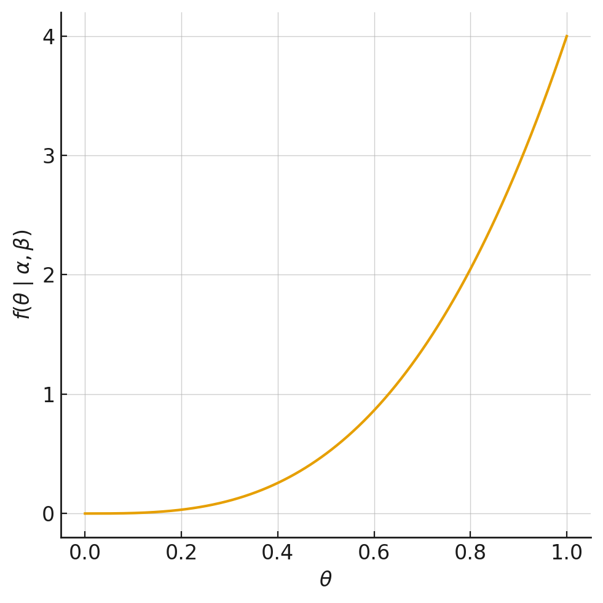
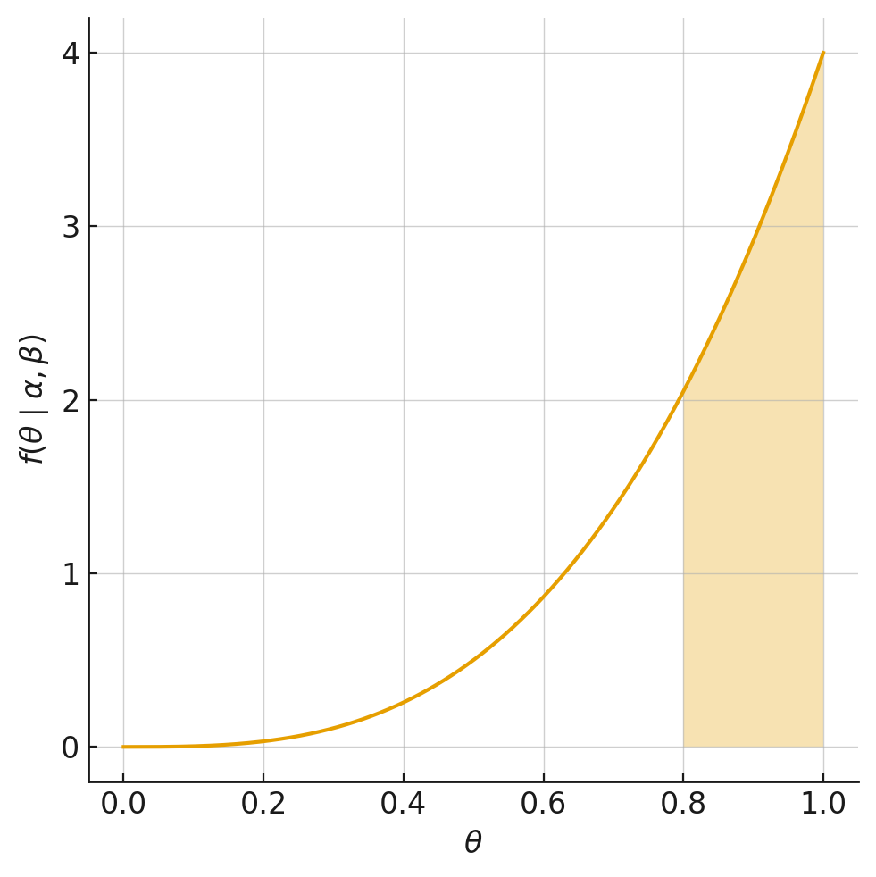

```{r echo=FALSE, warning=FALSE, }
library(rmarkdown)
library(latex2exp)
library(kableExtra)
```

# Modelos Probabilisticos

## Introducción

En este capítulo se abarcarán problemas con un enfoque probabilístico,
esto es, que se asume que los tomadores de decisiones se comportan
aleatoriamente. Esto permite abordar una gran cantidad de problemas
asociados al Marketing, los cuales se pueden caracterizar en tres tipos
de modelos básicos:

-   *Duración*: La pregunta clave es ¿Cuándo? Son situaciones ligadas a
    la duración de una determinada conducta del cliente, como por
    ejemplo: tiempo de permanencia en una compañía, tiempo de adopción
    de un cierto producto innovador, entre otros. Puede ser con tiempo
    continuo, o discreto.

-   *Conteo*: La pregunta clave es ¿Cuántos? Son situaciones ligadas al
    estudio de llegadas de clientes y contabilización de una determinada
    conducta, como por ejemplo: número de visitas a un portal web y la
    cantidad de productos comprados en una tienda de retail.

-   *Elección*: La pregunta clave es ¿Cuál? Son situaciones asociadas a
    las decisiones de elección de un determinado cliente, como por
    ejemplo: clientes que eligen responder (o no) a una campaña
    publicitaria y la elección de cambiar (o no) de canal de televisión.

Cada uno se estos modelos tiene muchas aplicaciones dentro de diversas
situaciones en la vida real. Comportamientos más complejos pueden ser
descritos usando combinaciones de los modelos básicos.

## Metodología

Dicho enfoque posee una metodología de modelamiento sugerida, que
comparten los modelos vistos a lo largo del curso.

La metodología consiste en:

1.  Determinar el problema de decisión a estudiar y la información
    requerida.

2.  Identificar el comportamiento observable (heterogeneidad) de interés
    a nivel individual. Típicamente, se denota con una $x_i$.

3.  Seleccionar la distribución de probabilidad que caracterice el
    comportamiento individual. Se consideran los parámetros de esta
    distribución, como características latentes a nivel individual.
    Típicamente, se denota con $f(x|\theta)$.

4.  Escoger la distribución que caracterice cómo las características
    latentes están distribuidas en la población. Se le llama
    distribución mixta o heterogénea. Típicamente, se denota con
    $g(\theta)$

5.  Derivar la distribución agregada, o distribución observable, del
    comportamiento de interés.

    $$
    f(x) = \int f(x|\theta)\, g(\theta)\, d\theta 
    \quad (\#eq:caso-continuo)
    $$

    $$
    p(x) = \sum_{i} f(x|\theta)\, Pr(\theta = \theta_{i}) 
    \quad (\#eq:caso-discreto)
    $$

<!-- -->

6.  Estimar los parámetros del modelo (de la distribución mixta),
    mediante el ajuste de la distribución agregada a los datos
    observados.

7.  Usar los resultados para tomar una decisión sobre el problema de
    marketing en cuestión.

## Problemas Teóricos

### E1: Tasa de respuesta

Una compañía de venta de ropa por catálogo busca decidir a que segmento
enviar los catálogos de la próxima colección. Para ello analiza la tasa
de respuesta de una muestra de clientes de cada segmento (esto es el
ratio entre número de clientes que compra y número de catálogos
enviados). Al mirar el primer segmento observa que de los 18 clientes a
quienes se les envió el catálogo, ninguno compró y por tanto decide no
enviar catálogos a ningún cliente de ese segmento. Esta compañía:

(a) Muy probablemente esté subestimando la tasa de respuesta de ese
    segmento.
(b) Debiera redefinir los criterios de segmentación para hacer grupos
    más grandes y accionables.
(c) Ha definido una política que da cuenta de su aversión al riesgo.
(d) Debiera usar un modelo de duración en tiempo continuo con
    dependencia en la duración.
(e) Debiera incorporar variables explicativas en su modelo predictivo.

### E2: Distribución Weibull

En relación a la distribución Weibull:

a.  Es un caso particular de la Poisson.
b.  Es una generalización de la Poisson.
c.  Sólo tiene un parámetro $c$.
d.  Es muy flexible y permite incluso generar distribuciones bimodales.
e.  Ninguna de las anteriores.

### E3: Distribución Gamma y Heterogeneidad

¿Cuál de los siguientes factores motivan la utilización de una
distribución Gamma para modelar la heterogeneidad de las tasas de
adopción en un modelo de duración en tiempo continuo? (Puede elegir más
de un factor).

i.  Consistencia con el dominio de la probabilidad de abandono en cada
    período.
ii. Para generar una fórmula recursiva de fácil implementación.
iii. Flexibilidad para acomodar distintas formas de la distribución.
iv. Para generar una fórmula cerrada que pueda ser calculada de manera
    computacionalmente eficiente.

### E4: Modelos de Duración

¿Cuáles de los siguientes modelos NO describe la duración de la relación
de los clientes con una firma?

a.  Beta-geométrica desplazada.
b.  Beta-geométrica NBD.
c.  Gamma-Weibull.
d.  Binomial Negativa.
e.  Ninguna de las anteriores.

### E5: Modelo NBD

Un modelo NBD describe la demanda de botellas de *oporto* en los últimos
6 meses. Si con este modelo se estima la demanda del próximo mes:

a.  Hay que hacer un modelo de regresión que considere la dinámica del
    problema.
b.  El cálculo no se puede hacer directamente, sin embargo podemos
    recalibrar el modelo considerando un horizonte de un mes.
c.  El histograma del número de botellas consumidas por cliente se
    moverá a la izquierda.
d.  La probabilidad de comprar $x$ botellas resulta ser simplemente 1/6
    veces las probabilidades calculadas para el primer semestre.
e.  Ninguna de las anteriores.

### E6: Modelos de Conteo

Un analista propone el uso de modelos de conteo para describir la
intensidad de la participación de los usuarios de la red social *X*. Los
parámetros que describen el comportamiento de los usuarios han sido
estimados usando datos de 4 días de actividad. El modelo ajusta
extremadamente bien. Sin embargo, al usar las estimaciones para
pronosticar la actividad del quinto día el modelo no ajusta bien. Al
respecto, se debiera concluir que:

a.  Se debe agregar la data para considerar la actividad agregada en
    todo el horizonte.
b.  Probablemente el comportamiento de los usuarios en el quinto día
    esté afectado por factores que no están presentes en los primeros
    cuatro días.
c.  Hay que calcular esperanzas condicionales.
d.  Los supuestos de comportamiento son errados y hay que desechar el
    modelo.
e.  Todas las anteriores.

### E7: Tiempo discreto en Modelos de Duración

En la práctica, siempre podemos discretizar el tiempo y por lo tanto no
hay motivos para usar modelo de duración en tiempo continuo. Discuta
respecto de la veracidad de esta afirmación.

-   Para eventos con gran variabilidad de tiempos de ocurrencia, un
    modelo de tiempo discreto podría requerir un número muy grande de
    periodos para describir el apropiadamente comportamiento bajo
    estudio.
-   Si el comportamiento tiene dependencia en la duración, dichas
    dependencias son fáciles de incluir en un modelo de tiempo continuo.

**Solucionario.**

E1: a\
E2: e\
E3: iii, iv\
E4: d\
E5: c\
E6: b

**E7: Tiempo discreto en Modelos de Duración**

-   **Correcto.** Esto muestra que en fenómenos con tiempos muy
    dispersos, el modelo discreto se vuelve poco práctico, mientras que
    el continuo es más parsimonioso.

-   **Correcto.** En continuo se pueden modelar directamente con
    funciones de riesgo (hazard) dependientes del tiempo, lo cual puede
    ser más complejo de representar en discreto.

## Problemas Aplicados

### Problema 1 (Control 2 2025-2)

VTV es una empresa aseguradora, en la que una de sus principales líneas
de negocio consiste en la provisión de cobertura de segunda línea para
clientes corporativos. En simple, VTV ofrece un seguro de salud que se
gatilla cuando ocurre un gasto médico, pero que se activa después de que
operen las coberturas obligatorias de Fonasa o Isapre. El servicio se
vende a empresas de distintos rubros para que sirvan como beneficio
complementario para sus trabajadores.

Recientemente, VTV ha lanzado un nuevo servicio llamado *TuBienestar*.
Este servicio ofrece que los empleados de las empresas clientes de VTV
puedan acceder a una batería de exámenes preventivos que aspiran a
detectar tempranamente problemas de consideración y así reducir los
gastos en salud a largo plazo. A continuación, usaremos modelos
probabilísticos para tener una primera aproximación del valor del
programa *TuBienestar*. Para eso, haremos uso de la base histórica de
gastos que contiene la valorización de todos los eventos de salud,
incluyendo consultas médicas, hospitalizaciones, exámenes y compra de
medicamentos. Aunque existe información más detallada de cada evento,
nos concentraremos en $n_{ijkt}$, correspondiente al número de eventos
de salud en el periodo t del beneficiario i, que pertenece al grupo j de
la empresa k. Notar que en esta base, los eventos están agrupados por
periodos trimestrales y los beneficiarios de cada empresa están
separados por segmento, ya que distintos tipos de empleados podrían
acceder a distintos beneficios.

1.  (2.0 puntos) Actualmente, VTV describe el número de eventos de cada
    beneficiario usando un modelo de Poisson. En este modelo, como los
    eventos de salud no son tan frecuentes, una gran proporción de los
    beneficiarios no registra eventos en un trimestre dado y, por tanto,
    el caso de cero eventos merece un tratamiento especial. Para modelar
    los eventos de gasto, se considera que, si hay un evento, el número
    de eventos se distribuye Poisson, pero que la probabilidad de no
    observar ningún evento es mayor que la de un modelo de Poisson
    tradicional. Escriba la log-verosimilitud de este modelo de conteo
    con ceros inflados. ***Hint:** Le puede resultar útil conceptualizar
    el modelo pensando que con probabilidad* $\pi$ *no hay ningún evento
    y que con probabilidad* $1-\pi$ *el proceso sigue distribución de
    Poisson standard.*
2.  Suponga ahora que, en vez de describir el número de eventos de cada
    beneficiario, nos concentramos en el número de beneficiarios que
    registra al menos un evento dentro de cada segmento-compañía. Así,
    como alternativa al modelo existente, se postula describir la
    ocurrencia de eventos de salud como un modelo de elección binaria.
    a)  (1.0 puntos) Suponiendo que puede haber segmentos con mayor
        propensión a registrar eventos, escriba la log-verosimilitud de
        un modelo binomial con dos clases latentes.
    b)  (1.0 puntos) Suponga que ha estimado el modelo y los estimadores
        máximos verosímiles vienen dados por
        $(\theta_1, \theta_2, \pi) = (0.1, 0.6, 0.5)$. Considere un
        segmento con 824 beneficiarios que, transcurrido un trimestre,
        evidencia 17 eventos de salud. Escriba una expresión para la
        probabilidad que este segmento corresponda a la clase de mayor
        propensión a registrar eventos.

Para las descripciones anteriores considere que $n_{jkt}$ es el número
total de beneficiarios que tuvieron algún gasto de salud en el trimestre
t dentro del segmento j de la empresa k y que $m_{jkt}$ es el número
total de beneficiarios dentro de ese segmento, empresa y trimestre.

3.  Como último enfoque, se estiman tres versiones de modelos
    beta-binomiales. En los modelos que se incluye heterogeneidad
    observable, se consideran variables asociadas tanto a
    características del segmento como a variables estacionales y de
    tendencia.

    | Variable            | Modelo 1     | Modelo 2     | Modelo 3     |
    |---------------------|--------------|--------------|--------------|
    | $\alpha$            | 0,127 \*\*   | 0,151 \*\*   | 0,149 \*     |
    | $\beta$             | 3,503 \*\*\* | 3,729 \*\*\* | 3,852 \*\*\* |
    | Sector:Minería      |              | 1,234 \*\*\* | 1,108 \*\*\* |
    | Sector:Construcción |              | 2,122 \*\*\* | 1,432 \*\*   |
    | Sector:Salud        |              | 1,784 \*\*\* | 1,665 \*\*\* |
    | Tamaño-Mediana      |              | 0,145        | -0,004       |
    | Tamaño-Grande       |              | 0,372 \*     | 0,401 \*     |
    | AntiguedadContrato  |              | 0,188 \*\*   | 0,193 \*\*   |
    | TuBienestar         |              |              | -0,089 \*\*  |
    | Invierno            |              | 2,921 \*\*\* | 2,955 \*\*\* |
    | Verano              |              | -0,539 \*    | -0,564 \*    |
    | Tendencia           |              | 0,278 \*\*   | 0,305 \*\*   |
    | **N. Obs**          | 34.825       | 34.825       | 34.825       |
    | **LL**              | -51.771,8    | -45.282,1    | -41.321,9    |
    | **AIC**             | 107.543,6    | 90.580,2     | 82.665,8     |

    $\text{Tabla 1. Estimadores máximo verosímiles de dos modelos beta-binomiales con variables explicativas.}$

    a.  (1.0 puntos) Discuta si el programa *TuBienestar* ayuda a
        describir el comportamiento de los beneficiarios y si el
        programa *TuBienestar* es bueno para la salud de los
        beneficiarios.
    b.  (1.0 puntos) En otros mercados el valor esperado de la
        probabilidad que un beneficiario exhiba un evento de salud en un
        trimestre dado es 0.16. ¿Cómo testearía si los datos de Chile
        son distintos a ese valor medio internacional?

**Solución**

1.  Siguiendo la indicación, la probabilidad de los eventos viene dada
    por:

    $$
    \Pr(N_{ijkt} = n \mid \lambda, \pi) =
    \begin{cases}
    \pi + (1 - \pi)e^{-\lambda} & n = 0 \\
    (1 - \pi) \dfrac{e^{-\lambda}\lambda^n}{n!} & n > 0
    \end{cases}
    $$

    Entonces, la función log-verosimilitud viene dada por:

    $$
    LL = \sum_{i} \sum_{j} \sum_{k} \sum_{t} 
    \left[
        1_{n_{ijkt}=0} \ln\left( \pi + (1 - \pi)e^{-\lambda} \right) + 
        1_{n_{ijkt}>0} \ln\left( (1 - \pi) \dfrac{e^{-\lambda}\lambda^n}{n!} \right)
    \right]
    $$

2.  Sean $\theta_1$ y $\theta_2$ las probabilidades de registrar un
    evento de las clases 1 y 2 respectivamente.

    a.  La probabilidad de observar exactamente $n$ eventos en el
        segmento de clientes $j$ de la empresa $k$ en el trimestre $t$
        viene dada por:

        $$ \Pr(n_{ijkt} = n \mid \theta_1, \theta_2, \pi) = \pi \binom{m}{n_{ijkt}} \theta_1^{n_{ijkt}} (1 - \theta_1)^{m - n_{ijkt}} + (1 - \pi) \binom{m}{n_{ijkt}} \theta_2^{n_{ijkt}} (1 - \theta_2)^{m - n_{ijkt}} $$Entonces,
        la log-verosimilitud viene dada por:
        $$ LL \;=\; \sum_{i}\sum_{j}\sum_{k}\sum_{t} \ln\!\Big( \Pr(n_{ijkt} \mid \theta_1,\theta_2,\pi) \Big) $$

    b.  Aplicamos la fórmula de bayes directamente:
        $$ \Pr(\lambda=\lambda_2 \mid n_{ijkt}=17) = \frac{\Pr(n_{ijkt}=17 \mid \lambda=\lambda_2)\,\Pr(\lambda=\lambda_2)} {\Pr(n_{ijks}=17 \mid \lambda=\lambda_1)\,\Pr(\lambda=\lambda_1) + \Pr(n_{ijkt}=17 \mid \lambda=\lambda_2)\,\Pr(\lambda=\lambda_2)}. $$
        Donde:
        $$ \Pr(n_{ijkt}=17 \mid \lambda=\lambda_1) = \binom{824}{17}\,(0.1)^{17}\,(1-0.1)^{824-17}, $$
        $$ \Pr(n_{ijkt}=17 \mid \lambda=\lambda_2) = \binom{824}{17}\,(0.6)^{17}\,(1-0.6)^{824-17}, $$
        $$ \Pr(\lambda=\lambda_1)=\Pr(\lambda=\lambda_2)=\tfrac{1}{2}. $$

3.  La parte a) requiere mirar los resultados de la tabla. La parte b)
    puede contestarse independientemente.

    a.  El AIC del modelo 2 es mayor que el AIC del modelo 3 que solo
        agrega la variable tuBienestar, y por tanto, la variable tiene
        valor explicativo. Se puede argumentar también que el
        coeficiente mismo de la variable es significativo y por tanto
        ayuda a explicar. Respecto al impacto en la salud, como el
        coeficiente es significativo y negativo, diríamos que aquellos
        que participan del programa tienen una menor probabilidad de
        generar eventos y por tanto el programa sería beneficioso. Sería
        deseable discutir que este efecto no es necesariamente causal,
        pero no lo consideraremos necesario.

    b.  Recordar que la esperanza de una $Beta(\alpha,\beta)$ viene dada
        por $\frac{\alpha}{\alpha+\beta}$. Por lo tanto, lo que
        necesitamos testear es que $\alpha=0.16(\alpha+\beta)$, que es
        una restricción lineal que puede testearse usando un test de
        ratios de verosimilitud.

### Problema 2

En el contexto del marketing B2B (Business to Business) para servicios
profesionales, las empresas han comenzado a incorporar el marketing de
contenidos (Content Marketing, CM) como parte integral de sus
estrategias comerciales. Estas iniciativas buscan, principalmente,
generar oportunidades de venta (leads) y fidelizar clientes existentes,
mediante la entrega de información de valor. El marketing de contenidos
puede adoptar múltiples formas, tanto en entornos presenciales como
digitales. Las actividades presenciales incluyen eventos cara a cara,
como seminarios, conferencias o talleres; mientras que las digitales
abarcan webinars, seminarios virtuales y la distribución de contenido a
através de plataformas digitales, como los sitios web corporativos.

En los mercados B2B, donde un número reducido de cuentas clave suele
concentrar una parte importante de las ventas, la gestión del marketing
de contenidos debe articularse cuidadosamente con los procesos
tradicionales de vents. Es habitual que estas organizaciones estructuren
el proceso de ventas en dos grandes etapas: generación de leads y
conversión de leads. Un lead representa una oportunidad de negocio que
se manifiesta a través de señales tempranas de interés por parte de una
cuenta clave, como una consulta por correo electrónico, una llamada
comercial, la solicitud de una cotización o la descarga de un folleto
técnico. Un lead se considera convertido cuando se concreta la venta y
se formalizan los compromisos de pago.

Un desafío relevante para la gestión analítica del marketing de
contenidos consiste en identificar qué tipos de actividaeds
-presenciales o digitales- generan un mayor número de leads, cuáles de
ellas contribuyen de forma más efectiva a su conversión. Asimismo, se
plantea la hipótesis de que el nivel de particiapción (engagement) de
los empleados de las cuentas clave podría desempeñar un rol mediador en
estos procesos.

En este contexto, Vectorix, una empresa B2B que ofrece servicios
profesionales, busca comprender cuáles componentes de su estrategia de
marketing de contenidos resultan más efectivos. La empresa sospecha que
la participación digital (por ejemplo, en webinars o mediante el consumo
de contenido online) tiene un impacto positivo en la generación y
conversión de leads. Sin embargo, la efectividad relavita de las
actividades presenciales frente a las digitales sigue siendo una
incógnita.

Con base a sus registros históricos de actividades de marketing y
resultados comerciales, Vectorix se propone desarrollar un análisis
cuantitativo que le permita evaluar la efectividad comparada de las
distintas acciones de marketing de contenido. El objetivo final es
orientar la asignación presupuestaria para los próximos dos trimestres,
priorizando aquellas tácticas que maximicen tanto la generación como la
conversión de oportunidades comerciales.

Los registros históricos se han condesando en una única base de datos
que contiene las siguientes columnas:

-   Idaccount: identificador de la cuenta clave.

-   Zone: área geográfica en que se encuentra la sede central de la
    cuenta clave.

-   Industry: industria a la que pertenece la cuenta.

-   Tenure: Número de años transcurridos desde que la empresa comenzó su
    relación con la cuenta.

-   Year: año fiscal.

-   Leads: Número de oportunidades generadas por la cuenta durante el
    año fiscal correspondiente.

-   ConvertedLeads: Número de oportunidades cerradas para la cuenta
    durante el año fiscal correspondiente.

-   NEventOffline: Número de eventos presenciales en los que partició la
    cuenta clave durante el año fiscal.

-   NeventOnline: Número de eventos digitales en los que partició la
    cuenta clave durante el año fiscal.

-   NEmployeeAccess: Número de empleados de la cuenta que ha tenido al
    menos algún acceso o consumo de contenido digital durante el año
    fiscal.

-   NAccessMean: Número promedio de accesos y consumos de contenido
    digital para los empleados de la cuenta que interactúan durante el
    año fiscal.

1.  Proponga un modelo de conteo (debe definir la variable dependiente
    utilizando la base de datos disponible, junto a sus índices) para
    describir el número de oportunidades ganadas mediante un modelo que
    integre heterogeneidad observable. Escriba la log-verosimilitud del
    modelo anterior y especifique cuántos parámetros deben estimarse. Si
    necesita, suponga conocida la cardinalidad de todos los índices del
    modelo y que hay un año de desfase, por lo que debe considerar el
    $t$ anterior. Para la construcción del modelo considere:

    a.  La industria y la zona a la que pertenecen cada cuenta incide en
        la posibilidad de generar y convertir más o menos oportunidades.
    b.  El tiempo de relación afecta las oportunidades ganadas. El
        primer año de relación, en general, hay un numero grande de
        oportunidades, el que cae marcadamente el segundo año para
        repuntar y mantenerse relativamente estable a partir del tercer
        año.
    c.  Se espera que la participación en eventos presenciales y
        digitales tienen un efecto en conversión de oportunidades, pero
        se hipotetiza que estos dos canales son sustitutos entre sí.
        Considere que los datos tienen un año de desfase, por lo que
        debe considerar el período anterior.
    d.  El número total de interacciones de los empleados debiera
        aumentar las oportunidades convertidas, pero el efecto adicional
        de cada nueva interacción tiende a ser menor a medida que el
        número de interacción crece.
    e.  Los procesos de conversión son relativamente lentos, por lo que
        las oportunidades convertidas dependen principalmente de la
        actividad del año anterior y no del año en curso. Considere que
        los datos tienen un año de desfase, por lo que debe considerar
        el período anterior.

2.  Usando los mismos supuestos del modelo anterior, construya un modelo
    de elección binaria con heterogeneidad observable para describir el
    número de oportunidades ganadas. Escriba la log-verosimilitud y
    especifique cuántos parámetros más deben estimarse con respecto al
    modelo anterior. ¿Qué ventajas puede tener un modelo de elección
    binario por sobre no de conteo (aplicado a este problema)?
    ***Hint:** Si le resulta conveniente en su notación, puede asumir
    que la tasa del modelo de conteo que captura todas las componentes
    relevantes del problema se denota* $\lambda_{it}(x_{it})$*, con*
    $x_{it}$ *un conjunto de variables observables de la cuenta* $i$ *en
    el año* $t$*.*

3.  Considerando que, quizás, la heterogeneidad observable no es
    suficiente para capturar toda la variabilidad del fenómeno, se
    consideró extender el modelo para incluir heterogeneidad no
    observable. Aunque en este nuevo modelo el conjunto de variables
    explicativas es algo distinto al del modelo sin heterogeneidad no
    observable, el ajuste en términos de la log-verosimilitud es
    bastante mejor, como indica la \@ref(tbl:loglike).

    | Modelo                  | Log-Likelihood |
    |-------------------------|----------------|
    | Regresión Binomial      | -10.145,0      |
    | Regresión Beta-Binomial | -9.855,4       |

    : Log-verosimilitud modelos alternativos. {#tbl:loglik}

    En relación al modelo binomial, ¿cuántos parámetros debiera tener el
    modelo de regresión beta-binomial para que sea preferido en términos
    de AIC?

**Solución**

1.  De acuerdo a las solicitudes:

    a.  Necesitamos incluir dummies para zonas ($\text{Zone}_{ih_1}$) y
        para industrias ($\text{Industry}_{ih_2}$), donde $h_1$
        corresponde a una zona existente de la base de datos, al igual
        que $h_2$, que corresponde a una industria existente.

    b.  Se pueden generar dos variables para los niveles de antigüedad
        (porque una de las tres debe ser la de referencia). Se genera
        $\text{Tenure2_{it}}$, que es equivalente a
        $\text{Tenure}_{it}\mathbf{1}\begin{cases} 1 & \text{si } t = 2 \\ 0 & \text{en otro caso} \end{cases}$
        y $\text{Tenure3}_{it}$, equivalente a
        $\text{Tenure}_{it}\mathbf{1}\begin{cases} 1 & \text{si } t \geq 3 \\ 0 & \text{en otro caso} \end{cases}$.

    c.  Hay que incluir el número de eventos físicos, digitales y su
        interacción.

    d.  El número total de interacciones es la multiplicación del número
        de empleados por el promedio de interacciones por usuario. Dado
        los rendimientos decrecientes, se debe transformar la variable a
        logaritmo.

        $$
        \begin{aligned}
        \lambda_{it} &= \big(\sum_{h_1} \alpha_{h_1} \text{Zone}_{ih_1}\big) + \big(\sum_{h_2} \alpha_{h_2} \text{Industry}_{ih_2}\big) + \beta_1 Tenure2_{it} + \beta_2 Tenure3_{it} \\
        &+ \beta_3 NEventOnline_{it-1} + \beta_4 NEventOffline_{it-1} \\
        &+ \beta_5 NEventOnline_{it-1} NEventOffline_{it-1} \\
        &+ \beta_6 ln\big(NEmployeeAccess_{it-1} NAccessMean_{it-1}\big)
        \end{aligned}
        $$

        Este modelo tiene $Z+I+6$ parámetros a estimar, donde
        $Z = \sum_{h_1}$ e $I = \sum_{h_2}$.

        La log-verosimilitud resulta de aplicar una distribución de
        Poisson:

        $$
        LL = \sum_{i}\sum_{t} n_{it} \ln\left(\frac{(\lambda_{it}t)^{x_{it}}e^{\lambda_{it}t}}{x_{it}!}\right)
        $$

        Donde $x_{it}$ es el número de oportunidades convertidas por la
        cuenta $i$ en el año $t$ y $n_{it}$ es el número de individuos
        que tuvieron esas $x_{it}$ oportunidades convertidas. Acá la
        heterogeneidad observada fue incluida en la regresión de Poisson
        descrita.

2.  El modelo es idéntico al anterior, pero en vez de describir la
    verosimilitud como un modelo de Poisson, ahora es un modelo
    binomial. Entonces:

    $$
    LL = \sum_{i}\sum_{t} {m_{it} \choose n_{it}} p_{it}^{n_{it}}(1-p_{it})^{m_{it}-n_{it}}
    $$

    Aquí, $m_{it}$ es el número de *leads* generados por la cuenta en el
    año y la probabilidad de conversión heterogenea viene dada por

    $$
    p_{it} = \frac{e^{\lambda_{it}(x_{it})}}{1+e^{\lambda_{it}(x_{it})}}
    $$

    El cual tiene el mismo número de parámetros que el caso anterior.

3.  Para preferir el modelo beta binomial, el AIC debiera ser menor que
    el de la regresión binomial. Entonces:

    $$
    (AIC_B = 2k_B - 2LL_B) > (2k_{BB} - 2LL_{BB} = AIC_{BB})
    $$

    Despejando y reemplazando los valores, $k_{BB} - k_{B} < 290$ (es
    decir, el modelo de regresión beta-binomial podría tener hasta 290
    parámetros más y seguiría siendo más preferido que el modelo de
    regresión de Poisson.

### Problema 3

Harcor es una importante firma latinoamericana que se concentra en la
producción y venta de caramelos y snacks. Aunque la compañía tiene una
estrategia multicanal, gran parte de sus ventas se concentra en el canal
tradicional de almacenes y kioscos. Este segmento es muy atomizado con
decenas de puntos de venta en el país y con una gran heterogeneidad
entre los almaceneros. Mientras algunos almacenes tienen un desarrollo
bien establecido con tiendas bien organizadas y sistemas automáticos de
registros de venta, otros operan en espacios informales y con malas
prácticas de gestión.

Para incentivar las ventas en el canal tradicional, Harcor ha creado un
programa de capacitación que ha denominado *El Club del Almacenero*, que
junto con proveer soporte en infraestructura de góndolas y estanterías
con las marcas de Harcor, ofrece también un plan de capacitación con las
mejores prácticas del comercio minorista, incluyendo temas de
publicidad, administración de inventarios, control de costos y
planificación de surtido. El plan de capacitación está inicialmente
pensado en 4 niveles de módulos, desde el más básico hasta al más
avanzado, de modo que para acceder a un nivel debe haberse completado el
nivel anterior.

Aunque el nivel de satisfacción de los participantes del programa de
capacitación es alto, el porcentaje de almaceneros que participa y
completa el programa ha sido más bien bajo en los primeros dos años de
operación por lo que Harcor está considerando hacer algunos ajustes al
programa. Para que los ajustes sean realizados basados en evidencia, el
equipo de analítica comercial se ha propuesto analizar los datos de
participación en las ediciones pasadas del programa. Para eso, a partir
de los registros históricos se ha generado una tabla, que, junto con un
conjunto de variables demográficas de los almaceneros, se registra
$x_{ikt}$ que toma el valor 1 si el almacenero $i$ participó en el nivel
$k$ en el programa de capacitación realizado en el año $t$.

1)  Suponga que el número de niveles de los cuales participa un
    almacenero queda descrito por un modelo beta geométrico desplazado
    de parámetros $\alpha$ y $\beta$.

    1)  (1 punto) Calcule una expresión para la probabilidad que un
        almacenero termine el programa de capacitación. Notar que la
        expresión debe poder calcularse a partir de los datos observados
        $x_{ikt}$ y los parámetros $\alpha$ y $\beta$.
    2)  (1 punto) Escriba la log-verosimilitud del problema. Al igual
        que en el caso anterior, exprese la log-verosimilitud en
        términos de $x_{ikt}$, $\alpha$ y $\beta$.

2)  Suponga que se estima el modelo usando el método de la máxima
    verosimilitud resultando los valores de la Tabla:

    | Variable | Coeficiente |
    |---------:|------------:|
    | $\alpha$ |       0.999 |
    |  $\beta$ |       4.001 |
    |        N |       1,245 |
    |       LL |      -2.583 |

    : $$
    \textbf{Tabla: } \text{Resumen de ventas para cada función.}
    $$

    a)  La Figura reporta la distribución beta evaluada en los
        estimadores máximos verosímiles de la Tabla. Por inspección de
        la figura, provea una aproximación numérica a la probabilidad de
        que un cliente no avance al siguiente nivel sea mayor que 0.8
        (usando áreas de triángulos y rectángulos).

        {width="60%"
        fig-align="center"}

    b)  Calcule el intervalo de confianza al 95% del segundo parámetro
        $\beta$. Considere que el inverso del hessiano de la
        log-verosimilitud, evaluada en el estimador máximo verosímil,
        viene dado por $\Sigma^{-1}$:

        $$
        \Sigma^{-1} \;=\;
        \begin{bmatrix}
        0.16 & 0.04 \\
        0.04 & 0.36
        \end{bmatrix}.
        $$

3)  Suponga ahora que se rediseña el programa de modo que los contenidos
    de un módulo son independientes de los otros y, por tanto, un
    almacenero puede atender cualquier módulo sin necesidad de haber
    completado los anteriores. Suponga que ya se han desarrollado tres
    módulos y falta uno por realizar. Escriba la verosimilitud de
    observar que un almacenero atiende a los tres módulos y otro atiende
    solo a uno, suponiendo que la asistencia se describe por un modelo
    beta-binomial.

4)  Si los estimadores máximos verosímiles de la beta binomial son
    $\alpha = 3.543$ y $\beta = 1.231$, escriba una expresión para el
    valor esperado de la probabilidad que un almacenero atienda al
    último módulo, si ya atendió a los tres primeros.

**Solución**

1)  Sea $D_{it}$ el número de niveles cursado por el almacenero $i$ en
    el año de ejecución $t$ y sea $s_{ikt}$ una variable binaria que
    toma el valor 1 si el almacenero cumple el curso
    $\,s_{ikt}=\begin{cases} \mathbb{1} & \text{si} \, \sum_h x_{iht} = 4 \\ 0 & \text{en otro caso} \end{cases}$.

    1)  La expresión es directa: $$
        \Pr(D_{it}=k\mid \alpha,\beta)=\frac{B(\alpha+1,\ \beta+k-1)}{B(\alpha,\beta)}
        $$

    2)  Usando las definiciones de arriba, la log-verosimilitud: $$
        LL=\sum_{t}\sum_{i}\sum_{k} s_{ikt}\,\log\!\Big(\mathbb{P}(D_{it}=4\mid \alpha,\beta)\Big)
        =\sum_{t}\sum_{i}\sum_{k} s_{ikt}\,\log\!\left(\frac{B(\alpha+1,\ \beta+k-1)}{B(\alpha,\beta)}\right)
        $$

        O bien, se puede absorber la suma para cada individuo $i$ si
        $n_{kt}=\sum_i s_{ikt}$, correspondiente al número de
        almaceneros que cursaron $k$ niveles. En dicho caso: $$
        LL=\sum_{t}\sum_{k} n_{kt}\,\log\!\Big(\mathbb{P}(D_{it}=k\mid \alpha,\beta)\Big)
        =\sum_{t}\sum_{k} n_{kt}\,\log\!\left(\frac{B(\alpha+1,\ \beta+k-1)}{B(\alpha,\beta)}\right)
        $$

2)  Para el primer caso:

    a)  La probabilidad $p$ corresponde al área bajo la curva, que puede
        aproximarse como\
        $$
        p \approx 0.2\cdot 2 + 0.2\cdot 2/2 = 0.6.
        $$

        {fig-align="center"
        width="60%"}

        b.  Usando el inverso del hessiano, el ientervalo de confianza
            viene dado por $4.001 \pm 1.96 \sqrt{0.36}$, donde el
            coeficiente $\beta$ corresponde la componente
            $\Sigma_{22}^{-1}$.

3)  Solo tenemos que multiplicar la probabilidad de los dos eventos:

    $$
    \begin{aligned}
    L(\theta) &= \mathbb{P}(D_{it} = 3 \mid \alpha, \beta) \mathbb{P}(D_{it} = 3 \mid \alpha, \beta) \\
    &= {3 \choose 3} \frac{\mathbb{B}(\alpha + 3, \beta)}{\mathbb{B}(\alpha, \beta)} \, {3 \choose 1} \frac{\mathbb{B}(\alpha + 1, \beta + 2)}{\mathbb{B}(\alpha, \beta)}
    \end{aligned}
    $$

4)  La probabilidad solicitada es simplemente la esperanza condicional
    del parámetro. En este caso, la distribución condicional de observar
    tres visitas positivas en tres módulos es
    $\mathbb{B}(\alpha + 3, \beta)$. La esperanza condicional de la
    probabilidad viene dada por

    $$\frac{\alpha + 3}{\alpha + \beta + 3} = 0.842$$

### Problema 4

En 1972, la *National Association of Food Chains* (NAFC) impulsó el uso
de códigos de barras para administrar los precios en las góndolas de los
supermercados en Estados Unidos. Desde aquel entonces, ha existido una
continua preocupación respecto a la precisión de estos mecanismos para
mantener información precisa respecto de los precios. Uno de los
problemas potenciales más relevantes del sistema es que los precios
cargados en el sistema podrían no estar bien coordinados con la
información de precios desplegada a los clientes en los flejes de las
góndolas. En simple, como la información de precios se realiza
manualmente, es posible que se generen diferencias entre lo que se
despliega de cara al cliente al momento de la elección, con lo que
efectivamente se cobra en caja.

Motivados por este problema, se ha decidido investigar la situación
actual de la precisión con que se despliegan los precios en la industria
supermercadista chilena. Más allá de la existencia de discrepancias, nos
interesa investigar la duración de estos eventos en que el precio
informado difiere del precio efectivamente cobrado. Para investigar
estas preguntas, se ha construido una base de datos que contiene
alrededor de 75.000 observaciones de precios realizadas durante 28 días
en una sala de supermercado de la Región Metropolitana, que considera
tanto el precio registrado en el sistema de cajas como el precio
exhibido en góndola. Mientras que los precios de cajas se obtienen
directamente de los sistemas transaccionales de la compañía, los precios
en góndola resultan de una inspección visual en sala, por un equipo de
revisores entrenados para ese propósito. La medición visual se hace
sobre una lista predefinida de productos sobre los que se registra el
precio exhibido.

Habiendo realizado la medición, se identifica que más de un 10% de los
precios registrados tiene asociada alguna discrepancia, es decir, que el
precio cobrado en caja no coincide con el precio exhibido en el fleje de
la góndola. Notar que las discrepancias pueden ser favorables para el
cliente o favorables para el supermercado. Por convención, llamaremos
discrepancias de tipo I a aquellas que favorecen al cliente y de tipo II
a las que favorecen al supermercado. Para entender con más detalle este
fenómeno de discrepancias, se ha seleccionado una base con todos los
registros con precios discrepantes. En esta base, cada fila se compone
de las siguientes variables:

-   **Id**: Identificador de un evento de discrepancia de precios.
-   **Day**: Día de la semana que se registra la discrepancia (con lunes
    = 1 y domingo = 7).
-   **Type**: Variable categórica con el tipo de discrepancia (Tipo I o
    Tipo II).
-   **Section**: Categoría del supermercado a la que pertenece el
    producto que presenta un diferencial (Abarrotes, Limpieza, Bebidas,
    Galletas y Cocktail).
-   **Duration**: Número de días que dura la discrepancia de precios
    entre el fleje y el sistema transaccional.
-   **Tag_price**: Precio que aparece en el fleje.
-   **Real_price**: Precio cobrado en caja.
-   **diff**: Diferencia entre precio fleje y precio real.

Para ilustrar la estructura de la base, las primeras entradas se
presentan en la Tabla 1:

|  Id | Day | Type | Section   | Duration | Tag_price | Real_price |  diff |
|----:|----:|:----:|:----------|---------:|----------:|-----------:|------:|
|   1 |   1 |  I   | limpieza  |        1 |      1668 |       1467 |   201 |
|   2 |   1 |  II  | abarrotes |        7 |      1162 |       9183 | -8021 |
|   3 |   2 |  I   | bebidas   |        1 |      7517 |       6616 |   901 |
|   4 |   1 |  I   | bebidas   |        1 |      1319 |       1160 |   158 |
|   5 |   5 |  I   | galletas  |        3 |      1411 |       1241 |   169 |
|   6 |   3 |  II  | galletas  |        2 |      1411 |       1641 |  -231 |

$$ \text{Tabla: Muestra de los primeros 6 registros de la base de discrepancias} $$

1.  Describa un modelo de duración probabilístico que permita describir
    cuántos días se mantienen las discrepancias y escriba la
    log-verosimilitud correspondiente. Defina cuidadosamente las
    variables de la función, especificando qué es parámetro y qué es
    dato. Para los datos, indique cómo se obtienen de los datos
    ilustrados en la Tabla 1.

2.  Suponga que complementario a los modelos de duración, se estiman dos
    modelos de regresión lineal para describir la duración de las
    discrepancias como variable dependiente. Los resultados de estos dos
    modelos se reportan en la Tabla 2.

    | Variable         |  Coef. M1 | p-valor M1 |  Coef. M2 | p-valor M2 |
    |:-----------------|----------:|:----------:|----------:|:----------:|
    | intercepto       |      3.55 |   0.0901   |    -1.353 |   0.1607   |
    | diff             |   -0.0002 |   0.7830   |         – |     –      |
    | log(Tag_price)   |   -0.2688 |   0.3661   |         – |     –      |
    | log(diff)        |         – |     –      |     0.563 |   0.0019   |
    | type.I           |      1.51 |   0.0210   |     2.168 |   0.0000   |
    | type.I:diff      |    0.0046 |   0.1165   |         – |     –      |
    | day.1            |         – |     –      |    -1.013 |   0.0061   |
    | section.limpieza |         – |     –      |     4.394 |   0.0000   |
    | section.cocktail |         – |     –      |    -1.329 |   0.0221   |
    | **R²**           | **0.096** |            | **0.136** |            |
    | **Adj. R²**      | **0.086** |            | **0.120** |            |

    $$ \text{Tabla: Resultados de dos modelos de regresión lineal para la duración de la discrepancia.} $$

    Más allá de la varianza explicada por cada modelo, ¿qué modelo le
    parece más adecuado? Provea al menos dos razones por las cuales
    prefiere el modelo elegido.

3.  Suponga que ahora se estiman tres modelos para describir la duración
    de discrepancias tipo I (aquellas que favorecen al cliente): un
    modelo geométrico desplazado sin heterogeneidad, un modelo
    beta-geométrico desplazado y un modelo de regresión geométrico
    desplazado en que el parámetro del modelo se asume dependiendo de la
    magnitud de la discrepancia ($\text{Diff}$) y si corresponde a la
    categoría de limpieza. Para garantizar que el parámetro $\theta$
    esté en el rango $[0,1]$ para incluir variables explicativas se
    aplica la transformación $$
    \theta_i \;=\; \frac{\exp(\beta\cdot x_i)}{1+\exp(\beta\cdot x_i)}.
    $$ Los estimadores máximo-verosímiles se muestran a continuación.
    Elija dos de los modelos y, para cada uno, calcule la probabilidad
    de que una discrepancia para un producto de limpieza, cuya
    diferencia de precios es 201, dure más de 3 días (deje la expresión
    simbólica; no es necesario valor numérico).

    | Parámetros | Geométrico desplazado | Beta geométrico | Regresión geométrica |
    |:-----------|----------------------:|----------------:|---------------------:|
    | $\theta_0$ |                  0.33 |               – |                 0.46 |
    | $\alpha$   |                     – |            2.08 |                    – |
    | $\beta$    |                     – |            2.62 |                    – |
    | Diff       |                     – |               – |                -0.43 |
    | limpieza   |                     – |               – |                -0.87 |
    | **LL**     |                  -788 |            -761 |                 -566 |
    | **AIC**    |                  1278 |            1526 |                 1142 |

    $$ \text{Tabla: Estimadores y criterios de información de tres modelos de duración.} $$

**Solución**

1.  Dado que la duración la observamos en días, parece más natural
    considerar un modelo de duración en tiempo discreto (la muestra de
    datos también sugiere que el proceso podría ser bastante discreto).
    Sea:

    -   $\theta$ = Probabilidad de que un producto deje de estar en
        discrepancia en un día dado.
    -   $T_i$ = la duración de la discrepancia de la observación $i$.
    -   $\tau$ = el máximo período de observación (28 días).
    -   $n_t$ = el número de casos en que observamos que la discrepancia
        dura $t$ días.

    Entonces, la log-verosimilitud viene dada por:

    $$
    LL \;=\; n_{\tau}\,\ln\!\big((1-\theta)^{\tau}\big)\;+\;\sum_{t=1}^{\tau-1} n_t\,\ln\!\big((1-\theta)^{t-1}\,\theta\big)
    $$

    Acá, $\theta$ es el único parámetro del modelo. Los datos son $n_t$
    y $n_{\tau}$ y se obtienen directamente a través de un conteo
    condicional en los valores de la columna Duration.

2.  Hay varias consideraciones que sugieren que el **Modelo 2** podría
    ser preferible.

    -   `diff` no es significativo en modelo 1, pero `log(diff)` sí lo
        es en modelo 2.
    -   El p-valor del tipo es menor en el modelo 2.
    -   La interacción que agrega el modelo 1 (`type.I × diff`) no es
        significativa.
    -   Las variables adicionales del modelo 2 sí son significativas.

3.  Las expresiones se derivan directamente de las definiciones y vienen
    dadas por:

    -   **Geométrica:** $\Pr(T>3\mid \theta_0)=(1-0.33)^3$.

    -   **Beta-Geométrica:** $$
        \Pr(T>3\mid \alpha,\beta)\;=\;\frac{B(2.08,\;2.62+3)}{B(2.08,\;2.62)}.
        $$

    -   **Regresión Geométrica:** $$
        \Pr(T>3\mid \theta_0,\theta_{\text{Diff}},\theta_{\text{lim}})\;=\;\left(\frac{1}{1+\exp(0.46+0.43\cdot 201+0.87)}\right)^{3}.
        $$

### Problema 5

Se acerca el verano (sí, hay que usar la imaginación) y tu última
práctica profesional. Como has sido una estudiante excepcional, pudiste
elegir con cuidado dónde realizarla y después de descartar varias
ofertas, decidiste aceptar la oferta de NotComida, una startup chilena
exitosa que basa su propuesta de valor en el diseño y manufactura de
productos alimenticios basados en plantas que funcionan como sucedáneos
cercanos a otros productos de origen animal, como la leche, el helado o
las hamburguesas. Cada vez que te piensas en lo que viene, se te escapa
un suspiro de satisfacción. Piensas en lo terrible que sería para ti
trabajar en una compañía que no esté alineada con tus ideales. A fin de
cuentas, entraste a estudiar ingeniería para cambiar el mundo. Para ti
este es solo el primer paso.

Todavía quedan dos semanas para que empiece la práctica, pero ya estás
ansiosa, por lo que recibes con entusiasmo y sorpresa un correo
electrónico de Kiara, quien será tu supervisora directa durante tu
estadía en la compañía. *"¡Hola! Esperando que estés muy bien, te
escribo para contarte los próximos desafíos en los que vamos a estar
trabajando en el equipo en los próximos seis meses. Por supuesto que no
es necesario que hagas absolutamente nada, pero como queremos que te
sientas integrada te vamos a ir copiando en las* *comunicaciones
internas del equipo".* Antes de cerrar el mensaje, te das el tiempo de
darle un vistazo rápido al diccionario de datos que viene adjunto:

| Variable | Descripción | Media |
|:------------------|:---------------------------------|:-----------------:|
| IdCliente | Identificador de cliente | \- |
| Mes | Mes {enero, febrero, …, diciembre} | \- |
| Año | Año | \- |
| Categoría | Categoría de producto {Hamburguesas, Leche, Helados} | \- |
| Tienda | Identificador de la tienda dónde se realizó la compra | \- |
| Edad | Edad del panelista | 31.3 |
| Mujer | 1 si la panelista se identifica como mujer | 0.51 |
| Ingreso | Ingreso mensual declarado por el panelista [millones CLP] | 0.56 |
| Zona Oriente | 1 si el panelista vive en la zona oriente de Santiago | 0.11 |
| NCompras | Número de compras en esa categoría y mes | 2.34 |

$$ \text{Tabla 1: Diccionario de datos del panel (variables y media cuando corresponde).} $$

Tienes súper claro que, de verdad, no tienes que hacer nada. Sin
embargo, te dan unas ganas enormes de empezar ya a pensar en cómo puedes
contribuir. El equipo se ha embarcado en una serie de proyectos para
entender el comportamiento de compra de los clientes y tú sabes que
tienes las herramientas para hacer una contribución. Aunque no estás tan
segura de en qué subproyecto te quieres involucrar, ya has delineado un
plan bastante claro de lo que te gustaría hacer. Considerando que la
fuente de datos principal es un panel de compras con el número de
unidades y montos comprados por cliente, se te ocurre que tu primer
modelo puede estar basado en un modelo de conteo.

1.  Proponga un modelo de regresión de Poisson en que la tasa de compra
    depende de cada individuo, categoría, tienda y semana. Escriba la
    log-verosimilitud del problema considerando que $n_{icst}$ es el
    número de unidades compradas por el cliente $i$ en la categoría $c$
    en la tienda $s$ el mes $t$. Para esto considere que:

    a.  Existe un efecto fijo por categoría y uno por tienda.
    b.  El género induce diferencias relevantes en las ventas y el
        efecto del género es distinto para la zona oriente de la
        capital.
    c.  Existe una tendencia creciente en las ventas. Como el
        crecimiento es relativamente pequeño, puede modelarse con un
        efecto fijo a nivel de año.
    d.  Aunque en el consumo es relativamente constante a lo largo del
        año, hay dos categorías que presentan una estacionalidad
        relevante. Mientras los helados tienen un patrón marcadamente
        diferente en los meses de diciembre, enero y febrero, las
        hamburguesas declinan sus ventas en el mes de septiembre.

2.  La investigación exploratoria de los datos sugiere que,
    restringiendo el análisis a la categoría $c=$ Hamburguesas, podría
    haber dos clases latentes. Un segmento de alto consumo y otro de
    consumo más bien ocasional. Para acomodar esta regularidad se
    propone un modelo sencillo en que la tasa de compra de un cliente
    $i$, independiente del mes, viene dado por:

    $$
    \log(\lambda_i) \;=\; \beta_{0i} + \beta_1 \text{MUJER}_i
    $$Donde $\beta_{0i}$ toma el valor $-1$ con probabilidad $0.4$ y el
    valor $0.5$ con probabilidad $0.6$. ¿Cuál es la probabilidad de que
    un cliente hombre, con MM\$1 de ingreso que no compra en un mes
    ($n_i=1$) pertenezca al segmento 1? Deje computada la probabilidad.

3.  Después de revisar los resultados de los modelos anteriores, te
    preguntas si dado el bajo número de compras registrados cada mes,
    quizás podría existir un modelo alternativo que pudiera complementar
    los aprendizajes anteriores. Rápidamente se te ocurre que quizás
    puedes definir una variable $y_{icst}$ que toma el valor 1 si el
    cliente $i$ compra en la categoría $c$ en la tienda $s$ el mes $t$
    (sí o no). Con esto, te resulta evidente que puedes estimar un
    modelo de elección discreta que describa la decisión de comprar o no
    de los clientes de la base.

    a.  Considerando los datos de la Tabla 2, que describen todas las
        compras observadas por el cliente 321045, escriba la
        log-verosimilitud del historial de compra de este cliente.

        | IdCliente | Mes | Año | Tienda | Categoría | Edad | Mujer | Ingresos | Zona Oriente | Ncompras |
        |:------:|:------:|:------:|:------:|:-------|:------:|:------:|:------:|:------:|:------:|
        | 321045 | Julio | 2021 | S816 | Hamburguesa | 26 | 0 | 1.3 | 0 | 1 |
        | 321045 | Septiembre | 2021 | S816 | Hamburguesa | 26 | 0 | 1.3 | 0 | 0 |

        $$ \text{Tabla 2: Historial resumido de compras del cliente 321045.} $$

**Solución**

1.  En un modelo de regresión de Poisson, la distribución ya viene dada
    y solo tenemos que especificar la tasa del proceso. Sea
    $\lambda_{icst}$ la tasa de compras del cliente $i$ en la categoría
    $c$ en la tienda $s$ el mes $t$. Además, definamos:

    -   $\delta_{ta}=1$ si el mes $t$ pertenece al año $a$.
    -   $\Delta^{1}_{ct}=1$ si $c=\text{Helado}$ y
        $t\in\{\text{diciembre, enero, febrero}\}$.
    -   $\Delta^{2}_{ct}=1$ si $c=\text{Hamburguesa}$ y
        $t=\text{septiembre}$.

    Entonces, la tasa de compra puede escribirse como $$
    \lambda_{icst}
    = \alpha_c + \alpha_s
    + \beta_1\,\text{MUJER}_i
    + \beta_2\,\text{MUJER}_i\cdot \text{ZORIENTE}_s
    + \sum_a \gamma_a\,\delta_{ta}
    + \theta_1\,\Delta^{1}_{ct}
    + \theta_2\,\Delta^{2}_{ct}.
    $$

    Tanto $\Delta^{1}_{ct}=1$ como $\Delta^{2}_{ct}=1$ pueden ser
    obtenidos usando una interacción entre Categoría, Tiempo y una
    indicatriz, que indique $\mathbb{1}$ cuando $t$ pertenece al mes
    indicado, y $0$ en caso contrario.

    Con esto, la **log-verosimilitud** viene dada por: $$
    LL
    = \sum_{i,c,s,t}\ln\big(\Pr(N_{icst}=n_{icst})\big)
    = \sum_{i,c,s,t}\ln\!\left(\frac{\lambda_{icst}^{\,n_{icst}}\,e^{-\lambda_{icst}}}{n_{icst}!}\right).
    $$

2.  Las tasas de compra de los dos segmentos vienen dadas por:

    $$
    log(\lambda_{i1}) = -1 + \beta_1 \text{MUJER}_i = -1 + 0 \implies \lambda_{i1} = e^{-1}
    $$

    $$
    log(\lambda_{i2}) = 0.5 + \beta_1 \text{MUJER}_i = 0.5 + 0 \implies \lambda_{i1} = e^{-0.5}
    $$

    Por tanto, la probabilidad de comprar una vez en cada segmento es:

    $$
    \mathbb{P}(n_i = 1 \mid s_1) = \lambda_{i1} e^{-\lambda_{i1}} = e^{-1}e^{-e^{-1}} 
    $$

    $$
    \mathbb{P}(n_i = 0 \mid s_2) = \lambda_{i2} e^{-\lambda_{i2}} = e^{-0.5}e^{-e^{-0.5}}
    $$

    Aplicando Teorema de Bayes:

    $$
    \mathbb{P}(s_1 \mid n_i = 1) = \frac{\mathbb{P}(n_i = 0 \mid s_1)\mathbb{P}(s_1)}{\mathbb{P}(s_1 \mid n_i = 0) \mathbb{P}(s_1) + \mathbb{P}(s_2 \mid n_i = 0) \mathbb{P}(s_2)}
    $$

    Donde $\mathbb{P}(s_1) \;=\; 0.4$ y $\mathbb{P}(s_2)  \;=\; 0.6$.

3.  La utilidad que deriva el cliente $i$ por comprar en la categoría
    $c$ en la tienda $s$ en el mes $t$ viene dado por:

    $$
    u_{icst} = \alpha_c + \alpha_c + (\beta_1 \text{MUJER}_i = 0) + (\beta_2 \text{MUJER}_i \text{ZORIENTE}_s = 0) + \sum_{a} \gamma_a \delta_{ta} + (\theta_1 \Delta_{ct}^1 = 0)+ \theta_2 \Delta_{ct}^2 
    $$

    Donde $\text{MUJER}_i \;=\; 0$ porque el registro es de un hombre, y
    $\theta_1 \Delta_{ct}^1 = 0$ porque aplica para helado y en los
    meses de verano, no septiembre y hamburguesa. Con esto, la log
    verosimilitud es:

    $$
    LL(\hat{\theta}) = \sum_{icst} y_{icst} ln\left(\frac{e^{u_{icst}}}{1+e^{u_{icst}}}\right) + (1-y_{icst})ln\left(\frac{1}{1+e^{u_{icst}}}\right)
    $$

### Problema 6

En los últimos 20 años, hemos visto un crecimiento explosivo en el uso
de redes sociales, con más de 4.4 billones de usuarios a nivel mundial y
con un promedio de más de 8 cuentas por usuario en las distintas
plataformas que han surgido en los últimos años. En este ecosistema, hay
un creciente interés por convertirse en *creador de contenido*, que les
permita generar audiencia que pueda eventualmente ser monetizada.
Cualquier persona con un dispositivo móvil puede crear contenido que
potencialmente puede volverse viral y captar niveles importantes de
atención de los usuarios. Ya sea tocando la guitarra y cantando, jugando
videojuegos o mostrando la ejecución de sofisticadas recetas de cocina,
muchos creadores buscan alcanzar altos niveles de visitas y generar
interacciones significativas con sus audiencias.

Considerando que existen un alto potencial comercial en la industria de
generación de contenido, se ha propuesto investigar en profundidad
cuáles son los factores que inciden en el nivel de interacciones entre
creadores y usuarios. Para estos efectos, se ha aliado con un nuevo
portal en que creadores de contenido pueden subir su material, el que es
exhibido a los usuarios de la plataforma usando un algoritmo interno que
personaliza el contenido de acuerdo con la probabilidad de generar
interacciones. Aunque hay varios niveles de interacción con el contenido
(ver, comentar, compartir), la plataforma considera que el número de *me
gusta* es la principal métrica para capturar el éxito relativo de una
publicación.

El portal tiene un módulo de analítica de datos que permite recolectar
algunas métricas claves de cada uno de los contenidos publicados en su
primer año de operación para todos los creadores registrados en el
portal. Entre los datos disponibles se encuentran las llaves para
identificar cada contenido y algunas características como la categoría
del contenido (información, humor o noticia), el número de caracteres,
el número de imágenes y la duración del video, si existiese.
Adicionalmente, y gracias a una alianza con una herramienta de
inteligencia artificial, se cuenta con el puntaje de cada contenido en
tres dimensiones distintos: producción, contenido y novedad.

| Variable | Descripción | Media |
|:------------------|:---------------------------------|:-----------------:|
| IdCC | Identificador de cliente | \- |
| IdPost | Identificador del contenido | \- |
| DatePost | Fecha de publicación del contenido | \- |
| Category | Categoría de producto {Information, Humour, News} | \- |
| Nchar | Número de caracteres en el texto del contenido publicado | 84.4 |
| Npic | Número de fotos en el contenido publicado | 0.4 |
| Tvid | Duración [seg] de los videos que acompañan el contenido | 18.5 |
| AIproduction | AI score en la calidad de la producción [0,1] | 0.5 |
| AIcontent | AI score en la calidad del contenido [0,1] | 0.3 |
| AInovelty | AI score en la novedad del contenido [0,1] | 0.2 |
| Nlikes | Número de *me gusta* que ha recibido la publicación | 12.5 |

$$ \text{Tabla 1: Descripción base de contenidos en la plataforma de creadores.} $$

1.  Modele el número de *me gusta* que recibe una publicación como un
    proceso de conteo con heterogeneidad observable. Para este modelo:

    a.  Justifique la inclusión de al menos dos variables explicativas
        indicando cuál es el signo esperado del coeficiente
        correspondiente.
    b.  Escriba la log-verosimilitud del problema. Indique cuáles son
        los parámetros para estimar y explicite cuántos parámetros tiene
        su modelo.
    c.  Suponiendo que ha estimado el modelo y los parámetros proveen
        una buena descripción de la distribución del número de *me
        gusta* que recibirá un post. Usando dichos estimadores, escriba
        una expresión para la probabilidad de que un cliente reciba al
        menos un *me gusta*.

2.  Una de las limitaciones del modelo anterior es que el uso del
    algoritmo interno de la plataforma implica una distribución muy
    heterogénea de exposiciones. Esto es, algunas publicaciones son
    desplegadas miles de veces, mientras que otras reciben muy poca
    exposición. Para hacer frente a este problema, se propone usar un
    modelo de elección.

    a.  Describa el proceso como un proceso de elección binaria con
        heterogeneidad no observable y escriba la log-verosimilitud del
        problema. Para eso, suponga que la base de datos también
        contiene una variable $Ndisp$ que, para cada post, indica el
        número de veces que fue expuesto.
    b.  Si al estimar el modelo, se encuentra que $\alpha=1$ y $\beta=2$
        son los estimadores máximo-verosímiles. En promedio, ¿con qué
        probabilidad a un cliente le gusta una publicación en la
        plataforma?
    c.  Considere una publicación que ha sido desplegada 100 veces y ha
        recibido 10 *me gusta*. Considerando los valores de
        $(\alpha,\beta)=(1,2)$, de la parte anterior, ¿cuántos *me
        gusta* esperaría observar luego de mostrar el contenido 200
        veces?

**Solución**

1.  Se tiene:

    a.  Cualquiera de las variables listadas puede justificarse de
        manera más o menos directa:

        -   **Efecto fijo por creador:** hay creadores más populares que
            otros.

        -   **Efecto fijo por fecha:** hay fechas en que los usuarios
            son más activos.

        -   **Dummies por categoría:** hay categorías que pueden generar
            más *me gusta*.

        -   **Nchar:** textos más largos o más cortos pueden ser más
            atractivos.

        -   **Npic:** agregar más fotos puede ser más atractivo.

        -   **Tvid:** videos más largos o más cortos pueden ser
            preferidos.

        -   **AIproduction:** material mejor producido puede generar más
            *me gusta*.

        -   **AIcontent:** contenido de mejor calidad puede generar más
            *me gusta*.

        -   **AInovelty:** material más novedoso puede generar más *me
            gusta*.

    b.  Aunque cualquier combinación de las variables arriba descritas
        es admisible, para efectos ilustrativos consideraremos un modelo
        en que la tasa de *me gusta* del contenido $i$ viene dada por:
        $$
           \lambda_i \;=\; \lambda_0 \cdot \exp\!\big(\beta_1\,\text{Nchar}_i + \beta_2\,\text{Npic}_i + \beta_3\,\text{Tvid}_i\big).
           $$ Con esto, la log-verosimilitud viene dada por: $$
           LL \;=\; \sum_i \ln\!\left(\frac{\lambda_i^{\,\text{Nlikes}_i}\,e^{-\lambda_i}}{\text{Nlikes}_i!}\right).
           $$

    c.  La probabilidad de recibir al menos un *me gusta* viene dada
        por: $$
           \Pr(\text{Nlikes}_i > 0 \mid \lambda_0,\boldsymbol{\beta})
           \;=\; 1 - \Pr(\text{Nlikes}_i = 0 \mid \lambda_0,\boldsymbol{\beta})
           \;=\; 1 - e^{-\lambda_i}.
           $$

2.  El modelo es una beta-binomial estándar. Recordar que la esperanza
    de una $\text{Beta}(\alpha,\beta)$ es $\alpha/(\alpha+\beta)$.

    a.  La log-verosimilitud de una beta-binomial: $$
        LL \;=\; \sum_i \ln\!\left(
        \binom{\text{NDisp}_i}{\text{Nlikes}_i}\;
        \frac{B\!\big(\alpha + \text{Nlikes}_i,\; \beta + \text{NDisp}_i - \text{Nlikes}_i\big)}{B(\alpha,\beta)}
        \right).
        $$

    b.  $$
        \mathbb{E}(\theta \mid \alpha,\beta) \;=\; \frac{\alpha}{\alpha+\beta} \;=\; \frac{1}{3}.
        $$

    c.  Se tiene que despejar la esperanza condicional

        $$
        \mathbb{E}\!\left(\theta_i \mid \alpha,\beta,\text{NDisp}_i,\text{Nlikes}_i\right) =\frac{\alpha+\text{Nlikes}_i}{\alpha+\beta+\text{NDisp}_i} =\frac{11}{103}.
        $$

        Entonces, el número esperado de *me gusta* al mostrar el
        contenido 200 veces es:$$
        200 \times \frac{11}{103} \approx 21.36.
        $$

        Notar que $\frac{11}{103}$ es el número esperado de likes de una
        persona, dada su verosimilitud (información previa) por su
        comportamiento esperado (distribución beta). Por eso, para 200
        personas simplemente se multiplica.

### Problema 7

Hippi es una empresa nacional dedicada a la fabricación de productos
para alta montaña. La empresa cuenta con una base de datos que registra
la compras que sus clientes en cada temporada y busca estudiar el numero
de parkas que los clientes comprarán en la temporada. Para esto, se ha
formulado un modelo probabilístico donde el comportamiento de los
clientes se describe como:

-   Cada cliente compra un numero de parkas X que sigue una distribución
    geométrica. Esto es, condicional en el parámetro p de cada cliente,
    la función de probabilidad esta dada por:

    $$
    Pr(X = x|p) = p(1-p)^x
    $$

-   Los clientes son heterogéneos en su parámetro p el que esta
    distribuido en la población de acuerdo a una distribución Beta:

$$g(p|\alpha,\beta) = \frac{1}{B(\alpha,\beta)} p^{\alpha - 1}(1-p)^{\beta-1}$$

Se puede mostrar que la distribución del número de compras para un
cliente en la población, y su respectiva esperanza están dadas por:

$$Pr(X=x) = \frac{B(\alpha + 1, \beta + x)}{B(\alpha,\beta)} \qquad \mathbb{E}(X) = \frac{\alpha}{\beta - 1}$$

Siguiendo la convención adoptada en el curso, llamamos a este modelo
Beta-Geométrico.

1.  Muestre que la penetración de mercado (fracción de clientes que
    compró al menos una unidad) puede expresarse como
    $\frac{\beta}{\alpha+\beta}$.

2.  Para ello considere que la penetración de mercado es del 60 % y que
    el numero promedio de parkas que compra un cliente (incluyendo
    aquellos que no compraron) es igual a 2.5. Estime los parámetros del
    modelo. *Hint: Realice un sistema de ecuaciones.*

3.  Se desea extender el modelo para que además incluya un segmento de
    clientes que nunca compra. Para este segmento de clientes,
    $Pr(X = 0) = 1$. Sea $\pi$ la proporción de estos clientes en la
    población, y $(1-\pi)$ el segmento de clientes que se comporta de
    acuerdo al modelo Beta-Geométrico descrito anteriormente. Suponga
    que conoce $x_i$, el numero de compras hechas por cada cliente i en
    la base de datos (i = 1, ..., n). Deduzca la función de
    verosimilitud que utilizaría para estimar el modelo.

**Solución**

1.  Despejando $p_0$:

    $$
    \begin{aligned} p_0 &= 1 - \Pr(X=0) \\ &= 1 - \frac{B(\alpha,\beta+1)}{B(\alpha,\beta)} \\ &= 1 - \frac{\Gamma(\alpha)\Gamma(\beta+1)}{\Gamma(\alpha+\beta+1)} \frac{\Gamma(\alpha+\beta)}{\Gamma(\alpha)\Gamma(\beta)} \\ &= 1 - \frac{\beta\,\Gamma(\beta)}{(\alpha+\beta)\,\Gamma(\beta)} \\ &= \frac{\alpha}{\alpha+\beta}. \end{aligned}
    $$

2.  A partir de la penetración de compra se despeja $\alpha$:

    $$
    0.6=\frac{\beta}{\alpha+\beta}\quad\Rightarrow\quad\beta=0.6(\alpha+\beta)\ \Rightarrow\ 0.4\beta=0.6\alpha\ \Rightarrow\ \alpha=\tfrac{2}{3}\beta
    $$

    Despejando $\beta$ utilizando el número promedio de parkas comprado
    por un cliente:

    $$
    2.5=\frac{\alpha}{\beta-1} \quad\Rightarrow\quad2.5=\frac{\tfrac{2}{3}\beta}{\beta-1} \Rightarrow\ \tfrac{2}{3}\beta=2.5(\beta-1) \Rightarrow\ \beta=\tfrac{15}{11}
    $$

    Entonces, sustituyendo:

    $$
    \alpha=\tfrac{2}{3}\beta=\tfrac{2}{3}\cdot\tfrac{15}{11}=\tfrac{10}{11}
    $$

3.  Sea $n_x$ el número de clientes que compra x parkas. Entonces, la
    verosimilitud puede escribirse como:

    $$
    L(\alpha,\beta,\pi |x) = \prod_{x=0}^{\infty} \mathbb{P}(X=x|\alpha,\beta,\pi)^{n_x}
    $$

    Donde,

    $$
    \begin{aligned}Pr(X=x \mid \alpha,\beta,\pi) &= \pi \, Pr(X=x \mid \text{no adopta}) + (1 - \pi)\, Pr(X=x \mid \text{puede adoptar}) \\[6pt]&= \begin{cases}\pi + (1-\pi)\dfrac{B(\alpha+1,\beta)}{B(\alpha,\beta)}, & x=0 \\[10pt](1-\pi)\dfrac{B(\alpha+1,\beta+x)}{B(\alpha,\beta)}, & x>0\end{cases}\end{aligned}
    $$

### Problema 8

Para revitalizar el interés de los usuarios, Pokémon Go está pensando
introducir 7 nuevos personajes Pokémon en las comunas de Melipilla,
Talagante, Pirque, Colina, Alhue, Paine, Lampa y Buin. Para estudiar el
impacto en el atractivo del juego, los desarrolladores han estado
realizando pruebas para ver el interés de los jugadores en estos nuevos
personajes. Las pruebas se han desarrollado sobre una muestra de
jugadores de acuerdo a los números desplegados en la siguietne tabla:

| Pokemon    | Melipilla | Talagante | Pirque | Colina | Alhue | Paine | Lampa | Buin | Total |
|--------|--------|--------|--------|--------|--------|--------|--------|--------|--------|
| Wigglytuff | 5         | 834       | 504    | 117    | 763   | 424   | 387   | 683  | 3,717 |
| Slowbrow   | 24        | 975       | 8      | 342    | 715   | 362   | 788   | 793  | 4,007 |
| Lickitung  | 101       | 651       | 200    | 993    | 562   | 614   | 691   | 595  | 4,407 |
| Chansley   | 198       | 517       | 960    | 788    | 441   | 844   | 836   | 438  | 5,022 |
| Tangela    | 79        | 990       | 756    | 868    | 210   | 944   | 509   | 233  | 4,589 |
| Ditto      | 69        | 587       | 96     | 365    | 182   | 634   | 373   | 419  | 2,725 |
| Phanpy     | 138       | 969       | 971    | 890    | 586   | 764   | 585   | 361  | 5,264 |

$$
\textbf{Tabla: } \text{Número de veces que un determinado pokemón fue mostrado a un jugador.}
$$

Existe dos parámetros relevantes para entender el grado de interacción
entre jugadores y personajes. El primer parámetro corresponde a $q_{k}$
que corresponde a la probabilidad de atrapar a un personaje, condicional
de que un jugador intente atraparlo. Aunque esta probabilidad es
relevante para saber en qué medida los usuarios aumentan su mazo, el
parámetro es ajustado internamente en la plataforma y, por tanto, no hay
incertidumbre desde el punto de vista de los usuarios. El segundo
parámetro que denominamos como $p_k$, mide la probabilidad que un
usuario intente atrapar un personaje $k$ si este le aparece disponible
en la aplicación móvil. Desde el punto de vista de la jugabilidad es
importante disponibilizar personajes que los usuarios quieran atrapar.
Para entender el comportamiento de esta intención de atrapar personajes,
la tabla siguiente despliega el número de intentos para los personajes y
comunas que forman parte del estudio piloto:

| Pokemon    | Melipilla | Talagante | Pirque | Colina | Alhue | Paine | Lampa | Buin | Total |
|--------|--------|--------|--------|--------|--------|--------|--------|--------|--------|
| Wigglytuff | 0         | 218       | 98     | 39     | 31    | 63    | 26    | 43   | 518   |
| Slowbrow   | 8         | 186       | 4      | 110    | 393   | 79    | 240   | 113  | 1,133 |
| Lickitung  | 8         | 47        | 13     | 98     | 183   | 180   | 219   | 60   | 808   |
| Chansley   | 49        | 31        | 274    | 24     | 48    | 91    | 205   | 42   | 764   |
| Tangela    | 14        | 294       | 71     | 35     | 59    | 304   | 116   | 2    | 895   |
| Ditto      | 14        | 180       | 14     | 110    | 33    | 84    | 0     | 10   | 445   |
| Phanpy     | 4         | 19        | 66     | 189    | 9     | 37    | 92    | 33   | 449   |

$$
\textbf{Tabla: } \text{Número de veces que un jugador intentó atrapar a un determinado pokemón.}
$$ A partir de los datos presentados:

1.  Use el método de los momentos para estimar un modelo binomial sin
    heterogeneidad que caracterice la probabilidad que un usuario
    intente atrapar a wigglytuff. ***Hint:** Con usar el método de los
    momentos, se refiere a que el primer momento de una distribución es
    el valor esperado, donde el valor esperado ed una distribución
    binomial es* $np$*.*
2.  Escriba ahora un modelo que incorpore heterogeneidad para
    caracterizar la probabilidad que un número de usuarios intente
    atrapar a un pokemón $k$ en una comuna $c$.
3.  Escriba la log-verosimilitud del modelo anterior, para entender la
    popularidad de cada uno de los personajes del estudio.

**Solución**

1.  Definimos una variable aleatoria que signifique lo buscado

    $$
    X_{w} := \text{# de usuarios que intentan atrapar a wigglytuf}
    $$Tenemos un número de experimentos Bernoulli (\# de personas a las
    que se les muestra wigglytuf) y un número de "éxitos" entre estos
    experimentos (\# de personas que intentan atrapar a wigglytuf cuando
    se les muestra) que ocurren con alguna probabilidad desconocidad
    $p_w$ fija, ya que nos piden el caso homogéneo (único valor). Por lo
    tanto, tenemos que la probabilidad que queremos caracterizar sería
    de la forma:

    $$
    P(X_w = x_w) =  {n_w \choose x_w} p_{w}^{x_w} (1-p_w)^{n_w - x_w}
    $$Donde $n_w$ es la cantidad de personas a las que se les mostró el
    pokemón (dato en la primera Tabla). Esdecir,
    $X_w \thicksim Bin(n_w,p_w)$. Sabemos que el primer momento de una
    distribución es su media y que la media de una binomial es
    $n_w p_W$. Por otro lado, estimamos el valor de la media con algún
    promedio muestras (con muestras del mismo tamaño) de número de
    personas que intentaron atrapar a wigglytuf, pero en este caso este
    número es único, por lo que usamos este valor (total de personas que
    intentaron atrapar a wigglytuf de la última tabla) que, en este
    caso, es 518. Por lo tanto, podemos obtener la probabilidad $p_w$
    con la igualdad del primer momento:

    $$
    518 = n_w p_w \\
    518 = 3717 p_w \\
    p_w \approx 0,1393
    $$

    Esto tiene mucho sentido, ya que estamos obteniendo la probabilidad
    de manera empírica con la fracción de personas que intentaron
    atraparlo y el número de personas a las que se les mostró.

2.  Como debemos considerar heterogeneidad, ahora el parámetro de la
    distribución que nos intersa, $p_k$, no lo asumimos como único, sino
    que sigue una distribución de probabilidad. Como el parámetro es una
    probabilidad ($p_k \in [0,1]$), utilizamos la distribución a priori
    $Beta(\alpha_k,\beta_k)$, con $\alpha_k$ y $\beta_k$ parámetros a
    estimar ($p_k \thicksim Beta(\alpha_k , \beta_k)$, por eso el sub
    $k$, ya que cada pokemón tiene un probabilidad $p_k$ asociada y no
    tienen porqué seguir la misma distribución). Luego, tenemos que cada
    comuna nos va a estar aportando en realidad datos sobre la
    heterogeneidad existente para cada pokemón (sería el equivalente a
    tener distintas observaciones para distintos individuos). Así, la
    probabilidad quedaría, para cada pokemón y comuna, con la v.a.
    anterior, pero segmentando por comuna:

$$
P(X_{k,c} = x_{k,c}) = \int_0^1 P(X_{k,c} = x_{k,c} | p_k)Beta(p_k|\alpha_k, \beta_k) dp_k \\
= \int_0^1 \left( {n_{k,c} \choose x_{k,c}} p_{k}^{x_{k,c}} (1-p_{k})^{n_{k,c} - x_{k,c}}\right)   \left(\frac{p_k^{\alpha_k -1} (1-p_k)^{\beta_k -1}}{B(\alpha_k,\beta_k)} \right) dp_k\\
={n_{k,c} \choose x_{k,c}} \frac{B(\alpha_k + x_{k,c},\beta_k + n_{k,c}- x_{k,c})}{B(\alpha_k,\beta_k)}
$$

3.  Nos interesa analizar cada personaje por separado, por lo tanto
    vamos a tener una expresión de la log-verosimilitud del parámetro
    $p_k$ para cada pokemón. Luego, la muestra que tenemos de la v.a. en
    cuestión para cada pokemón $k$ es de la forma
    $\{ x_{k,1},x_{k,2},...,x_{k,7} \}$, donde el segundo índice es para
    cada una de las comunas. Sigue que la log-verosimilitud es el
    logaritmo de la función de verosimilitud con esta muestra para cada
    pokemón:

    $$
    \begin{aligned}
    \ell (p_k |  x_{k,1}, ...,  x_{k,8}) &= \ln (\mathcal{L}(p_k |  x_{k,1}, ...,  x_{k,8})) \\
    &= \ln(P(X_{k,1}=x_{k,1}, ...,X_{k,8}=x_{k,8} |p_k)) \\
    &= \ln \left( \prod_{c=1}^8 P(X_{x,c} = x_{x,c}|p_k) \right) \\
    &= \sum_{c=1}^8 \ln(P(X_{k,c}=x_{k,c}|p_k)) \\
    &= \sum_{c=1}^8 \ln \left( {n_{k,c} \choose x_{k,c}}\frac{B(\alpha_k + x_{k,c},\beta_k + n_{k,c}- x_{k,c})}{B(\alpha_k,\beta_k)} \right)
    \end{aligned}
    $$

    Esta es la expresión pedida de la log-verosimilitud para cada
    pokemón k. En el tercer paso asumimos indepndencia de las v.a. entre
    columnas y en el último paso reemplazamos por la expresión
    encontrada en la parte anterior.

### Problema 9

Inmersos en la era digital, los consumidores están cada vez conectados
en distintos dispositivos los cuales pueden ser usados como canales
durante el proceso de compra. En este contexto, algunas empresas han
decidido lanzar aplicaciones móviles que funcionan en base a información
georreferenciada de los dispositivos de sus clientes, y que permiten
enviarles promociones personalizadas cuando identifica que este se
encuentra cercano a un punto de venta.

La aplicación que más éxito ha tenido en el mercado, quiere evaluar la
efectividad de las campañas que envían a sus usuarios, y así poder
ofrecer un mejor servicio a las empresas que lo contratan. Para esto,
cuenta con información de los $m_{i}$ mensajes promocionales que envía
al cliente $i$, y el número $x_{i}$ de esos que son efectivamente
utilizados por el cliente.

1.  Plantee un modelo de elección para determinar la probabilidad de
    respuesta de cada cliente, en cada ocasión de compra. En particular,

    a.  Escriba la log-verosimilitud del problema.
    b.  Sea $N$ el número de clientes. Si se observa el comportamiento
        por $T$ períodos y en promedio se envían $M$ promociones por
        cliente, ¿cuántos parámetros deben estimarse?

<!-- -->

2.  Considere que se cuenta con información demográfica de los usuarios
    de la aplicación móvil, como edad, Ingreso y frecuencia de uso de la
    app. Reformule el modelo anterior incorporando variables
    explicativas considerando además que existe un segmento de clientes
    que realiza pocos canjes y otro que realiza muchos (es decir, un
    segmento canjeador *C* y otro no-canjeador *N*). ***Hint**: Recuerde
    que si* $x\in\mathbb{R}$*, entonces*
    $\frac{exp(x)}{1+exp(x)}\in(0,1)$.

3.  Suponga que se ha estimado el modelo anterior y se encuentra que los
    segmento canjeadores y no-canjeadores tienen el mismo tamaño y que
    los parámetros asociados a las variables explicativas son tales que
    para un usuario $i$ con un vector de variables explicativas $z_{i}$,
    $\beta'_{C}x_{i}=ln(2)$ y $\beta'_{N}x_{i}=ln(1/2)$. Si al usuario
    le han enviado dos promociones y ha canjeado las dos, ¿cuál es la
    probabilidad que este usuario pertenezca al segmento de canjeadores?

4.  Suponga ahora que del total de $m_{i}$ mensajes que recibe un
    usuario este lee $n_{i}$ de ellos. De los $n_{i}$ mensajes que
    efectivamente lee, decide canjear $x_{i}$ de ellos. Modele el
    comportamiento anteriormente descrito como un modelo integrado
    elección-elección. Plantee explícitamente la probabilidad de canje y
    la log-verosimilitud del problema.

**Solución**

1.  Por partes:

    1.  Sea $X_i$ el número de veces que la persona $i$ hace efectivo un
        cupón. La probabilidad de respuesta es $$
        \mathbb{P}(X_i=x_i \mid p_i) = \binom{m_i}{x_i}\, p_i^{\,x_i} (1-p_i)^{\,m_i-x_i}
        $$ donde la log-verosimilitud viene dada por $$
        LL(p) = \sum_i \ln\!\Big(\binom{m_i}{x_i}\, p_i^{\,x_i} (1-p_i)^{\,m_i-x_i}\Big)
        $$
    2.  Se deben estimar $N$ parámetros, uno para cada cliente (lo que
        sugiere introducir heterogeneidad).

2.  Modelo de elección con dos segmentos. Sea $p_{iC}$ la probabilidad
    de canje si $i$ pertenece al segmento canjeador y $p_{iN}$ si
    pertenece al segmento no canjeador. Sea $\pi$ la fracción de
    clientes canjeadores. Entonces
    $$\mathbb{P}(X_i=x_i \mid \beta,\pi) = \pi \binom{m_i}{x_i} p_{iC}^{\,x_i}(1-p_{iC})^{\,m_i-x_i} + (1-\pi) \binom{m_i}{x_i} p_{iN}^{\,x_i}(1-p_{iN})^{\,m_i-x_i}$$
    donde
    $$p_{iC} = \frac{\exp(\beta_C' z_i)}{1+\exp(\beta_C' z_i)}, \qquad p_{iN} = \frac{\exp(\beta_N' z_i)}{1+\exp(\beta_N' z_i)}$$
    y la log-verosimilitud es
    $$LL = \sum_i \ln\!\Big( \pi \binom{m_i}{x_i} p_{iC}^{\,x_i}(1-p_{iC})^{\,m_i-x_i} + (1-\pi) \binom{m_i}{x_i} p_{iN}^{\,x_i}(1-p_{iN})^{\,m_i-x_i} \Big)$$

3.  Probabilidad posterior de pertenecer al segmento canjeador dado
    $X_i=2$ (usando probabilidades condicionales):

    $$
    \mathbb{P}(C \mid X_i=2) = \frac{\mathbb{P}(X_i=2 \mid C)\,\mathbb{P}(C)} {\mathbb{P}(X_i=2 \mid C)\,\mathbb{P}(C) + \mathbb{P}(X_i=2 \mid N)\,\mathbb{P}(N)}
    $$ donde, para $m_i=2$, $$
    \mathbb{P}(X_i=2 \mid C) = \binom{2}{2} \left[\frac{\exp(\beta_C' z_i)}{1+\exp(\beta_C' z_i)}\right]^2 \left[\frac{1}{1+\exp(\beta_C' z_i)}\right]^{2-2} = \frac{4}{9}
    $$

    $$
    \mathbb{P}(X_i=2 \mid N) = \binom{2}{2} \left[\frac{\exp(\beta_N' z_i)}{1+\exp(\beta_N' z_i)}\right]^2 \left[\frac{1}{1+\exp(\beta_N' z_i)}\right]^{2-2} = \frac{1}{9}
    $$ y, tomando $\mathbb{P}(C)=\mathbb{P}(N)=\tfrac12$, $$
    \mathbb{P}(C \mid X_i=2) = \frac{\frac{4}{9}\cdot \frac12}{\frac{4}{9}\cdot \frac12 + \frac{1}{9}\cdot \frac12} = \frac{4}{5}
    $$

4.  Lectura y canje con dos etapas. La probabilidad de leer un mensaje
    es:

    $$
    \begin{aligned}        \mathbb{P}(X_i=x_i \mid p_{\text{canjear}}, p_{\text{leer}})      &= \sum_{n_i=x_i}^{m_i}         \mathbb{P}(X_i=x_i \mid p_{\text{canjear}}, n_i)\,         \mathbb{P}(N_i=n_i \mid p_{\text{leer}}) \\      &= \sum_{n_i=x_i}^{m_i}         \binom{n_i}{x_i}\, p_{\text{canjear}}^{\,x_i}(1-p_{\text{canjear}})^{\,n_i-x_i}\,         \binom{m_i}{n_i}\, p_{\text{leer}}^{\,n_i}(1-p_{\text{leer}})^{\,m_i-n_i}    
    \end{aligned}
    $$

    y la log-verosimilitud se describe como:

    $$
        LL      = \sum_i \ln\!\big(\mathbb{P}(X_i=x_i \mid p_{\text{canjear}}, p_{\text{leer}})\big)    
    $$
