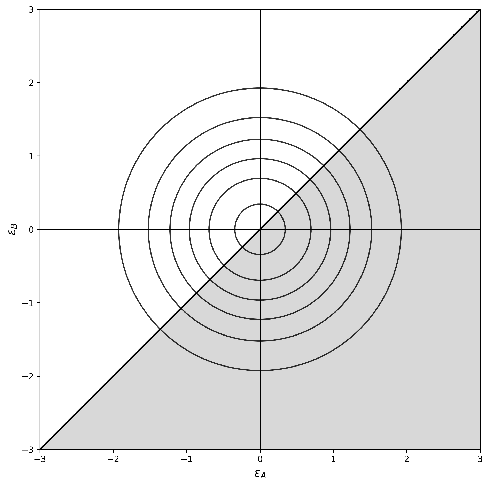

# Modelos Estructurales

```{r echo=FALSE, warning=FALSE, message=FALSE}
library(rmarkdown)
library(latex2exp)
library(kableExtra)
```

## Introducción

Los modelos de elección discreta buscan modelar **comportamiento** (toma de decisiones), describiendo la probabilidad de que un agente $n$ elija la alternativa $i$, es decir, $P_{ni}$. Se asume que el individuo decide entre las alternativas tal que éste maximiza sus utilidades $u_{ni}$.

En general, los modelos de decisión discreta se definen como $u_{ni} = v_{ni} + \varepsilon_{ni}$, con $v_{ni}$ la componente determinista y $\varepsilon_{ni}$ la componente estocástica.

A continuación se presentan los modelos estructurales abordados en el curso:

### Modelo Logit

El modelo logit es un modelo de elección discreta ampliamente utilizado para analizar decisiones en las que un individuo selecciona una alternativa entre un conjunto finito de opciones. Este modelo asume que los individuos maximizan su utilidad $u_{ni}$, la cual se divide en una componente determinista (observable) $v_{ni}$ y una estocástica (no observable) $\varepsilon_{ni}$, con la componente estocástica siguiendo una distribución de valor extremo Gumbel tipo 1.

La probabilidad de que un agente $n$ elija la alternativa $i$ viene dada por:

$$P_{ni} = \frac{e^{v_{ni}}}{\sum_j e^{v_{nj}}}$$

Donde los parámetros del modelo pueden ser estimados usando el método de máxima verosimilitud con $v_{ni} = \beta' x_{ni}$:

$$LL(\beta) = \sum_n \sum_i y_{ni} \ln(P_{ni})$$

Con $x_{ni}$ un conjunto de covariables y $y_{ni} = 1$ si $n$ elige la alternativa $i$, 0 en caso contrario.

#### Persistencia de Elección (Lealtad) y Precios de Referencia

En modelos de panel con observaciones repetidas, es posible incorporar efectos dinámicos como la **lealtad** y los **precios de referencia**:

**Lealtad:** Se introduce una variable de lealtad latente $z_{nit}$ que captura la propensión del individuo a repetir elecciones previas:

$$z_{nit} = \lambda z_{nit-1} + (1-\lambda) y_{nit-1}$$

donde $0 \leq \lambda \leq 1$ es un parámetro de decaimiento.

**Precios de Referencia:** Los consumidores comparan precios actuales con un precio de referencia interno formado a partir de precios observados en el pasado:

$$RP_{nit} = \lambda RP_{nit-1} + (1-\lambda) P_{nit-1}$$

La utilidad se especifica incorporando la desviación respecto al precio de referencia:

$$u_{nit} = \alpha_i + \beta_1 P_{nit} - \beta_2(P_{nit} - RP_{nit}) + \delta x_{nit} + \varepsilon_{nit}$$

### Modelo Probit

El modelo probit es un modelo de elección discreta utilizado para analizar decisiones en las que un individuo selecciona una alternativa entre un conjunto finito de opciones. Este modelo asume que los individuos maximizan su utilidad $u_{ni}$, la cual se divide en una componente determinista (observable) $v_{ni}$ y una estocástica (no observable) $\varepsilon_{ni}$, con la componente estocástica siguiendo una **distribución normal estándar**.

Asumiendo que el término del error $\varepsilon_{ni}$ se distribuye normal multivariado centrado en 0:

$$\phi(\varepsilon_n) = \frac{1}{(2\pi)^{I/2} |\Sigma|^{1/2}} e^{-\frac{1}{2} \varepsilon'_n \Sigma^{-1} \varepsilon_n}$$

La matriz de covarianza $\Sigma$ tiene una dimensión $I \times I$, con $I$ la cantidad de alternativas de elección. Como la matriz es simétrica, esta tiene $I(I+1)/2$ parámetros.

La probabilidad de elección se aproxima mediante simulación:

$$\hat{P}_{ni} \approx \frac{1}{R} \sum_{r=1}^R \mathbb{1}[\varepsilon^r_{nj} - \varepsilon^r_{ni} < v_{ni} - v_{nj}, \forall j \neq i]$$

Los parámetros del modelo se estiman usando el **método simulado de máxima verosimilitud (SMLE)**:

$$\hat{\theta} = \arg\max \sum_n \sum_i y_{ni} \ln(\hat{P}_{ni})$$

### Modelo Nested Logit

El modelo Nested Logit es una extensión del modelo Logit que organiza las alternativas en 'nidos' o grupos que comparten características comunes, permitiendo modelar correlaciones entre opciones dentro de un mismo nido. Este modelo relaja la suposición de independencia de alternativas irrelevantes (IIA) al introducir un parámetro de correlación para cada nido.

La probabilidad de que un agente $n$ elija la alternativa $j$ se descompone como el producto de la probabilidad de elegir la alternativa $j$ dado que eligió el nodo $B_k$ que contiene la alternativa $j$, multiplicado por la probabilidad de elegir el nodo $B_k$:

$$P_{nj} = P_{nj|B_k} \cdot P_{nB_k}$$

Donde:

$$P_{nj|B_k} = \frac{e^{v_{nj}/\lambda_k}}{\sum_{i \in B_k} e^{v_{ni}/\lambda_k}}$$

$$P_{nB_k} = \frac{e^{w_{nk} + \lambda_k IV_{nk}}}{\sum_h e^{w_{nh} + \lambda_h IV_{nh}}}$$

Con $IV_{nk} = \ln\left(\sum_{j \in B_k} \exp\left(\frac{v_{nj}}{\lambda_k}\right)\right)$ el valor inclusivo del nido.

El conjunto de parámetros $\{\lambda_k\}_{k=1}^K$ mide el grado relativo de independencia en la parte no observable de la utilidad entre las alternativas del nido $k$. Probar que $\lambda_k = 1$ para todos los nidos podría llevarnos de vuelta al modelo logit simple.

### Modelo Mixed Logit

El modelo Mixed Logit es una extensión del modelo Logit que permite modelar la heterogeneidad de preferencias entre los individuos. A diferencia del modelo Logit tradicional, los parámetros de la utilidad $u_{ni}$ no son constantes, sino que varían aleatoriamente en la población.

La utilidad de un individuo $n$ para una alternativa $i$ se define como:

$$u_{ni} = \beta'_n x_{ni} + \varepsilon_{ni}$$

donde $\beta_n$ es un vector de coeficientes específicos de cada individuo, que sigue una distribución probabilística $f(\beta|\theta)$ en la población.

La probabilidad de elección de la alternativa $i$ por el individuo $n$ es:

$$P_{ni} = \int \frac{e^{\beta' x_{ni}}}{\sum_j e^{\beta' x_{nj}}} f(\beta|\theta) d\beta$$

donde $f(\beta|\theta)$ describe la distribución de los parámetros en la población, comúnmente asumida como normal multivariada: $\beta \sim N(b, V_b)$.

**Estimación:** Para estimar los parámetros, se utiliza el **método de máxima verosimilitud simulada (SMLE)**. La probabilidad simulada se calcula como:

$$\hat{P}_{ni} = \frac{1}{R} \sum_{r=1}^R \frac{e^{\beta'_r x_{ni}}}{\sum_j e^{\beta'_r x_{nj}}}$$

con $\beta_r$ siendo una muestra de $f(\beta|\theta)$ y $R$ el número de simulaciones.

### Logit con Clases Latentes

El modelo de Clases Latentes asume que la población está compuesta por un número finito de segmentos o clases, cada uno con parámetros específicos de preferencia. A diferencia del Mixed Logit, aquí se considera que las preferencias dentro de cada clase son homogéneas, pero varían entre clases.

La utilidad de un individuo $n$ para una alternativa $i$ en la clase $m$ se define como:

$$u_{ni|m} = \beta'_m x_{ni} + \varepsilon_{ni}$$

La probabilidad de que el individuo $n$ elija la alternativa $i$ se define como:

$$P_{ni} = \sum_m s_m \frac{e^{\beta'_m x_{ni}}}{\sum_j e^{\beta'_m x_{nj}}}$$

donde $s_m$ es la proporción de la población en la clase $m$ y $\beta_m$ son los parámetros específicos de la clase $m$.

**Estimación:** Para estimar los parámetros, se maximiza la función de verosimilitud:

$$LL(\{\beta_m, s_m\}_{m=1}^M) = \sum_n \sum_i y_{ni} \ln\left(\sum_m s_m \frac{e^{\beta'_m x_{ni}}}{\sum_j e^{\beta'_m x_{nj}}}\right)$$

con restricciones sobre $s_m$ para asegurar que representen proporciones válidas: $0 \leq s_m \leq 1$ y $\sum_m s_m = 1$.

## Metodología

La estimación de los modelos estructurales comparte una metodología:

1. **Especificación de la utilidad:** Definir la función de utilidad $u_{ni}$ con sus componentes determinísticas $v_{ni}$ y estocásticas $\varepsilon_{ni}$.

2. **Derivación de probabilidades:** Calcular las probabilidades de elección $P_{ni}$ según el modelo especificado (Logit, Probit, Nested Logit, Mixed Logit, o Clases Latentes).

3. **Construcción de la verosimilitud:** Escribir la función de (log-)verosimilitud basada en las observaciones $y_{ni}$.

4. **Estimación:** Para modelos con solución cerrada (Logit, Nested Logit, Clases Latentes), se utiliza **máxima verosimilitud directa**. Para modelos sin solución cerrada (Probit, Mixed Logit), se emplea **máxima verosimilitud simulada (SMLE)**.

5. **Evaluación:** Calcular métricas de ajuste como $\rho$ de McFadden, AIC, BIC y validar la significancia estadística de los parámetros.

6. **Interpretación:** Analizar los parámetros estimados, calcular elasticidades y evaluar implicaciones para la toma de decisiones.

## Problemas Teóricos

### Pregunta 1

Suponga que dispone de una muestra de tamaño $R$ de los parámetros que definen la utilidad de elección en un modelo logit. Describa cómo estimar la probabilidad que un consumidor $n$ elija la alternativa $i$.

### Pregunta 2

¿Cómo se calcula el Akaike Information Criterion (AIC) para un modelo cuya verosimilitud $f(X|\theta)$ es maximizada en un único valor de $\hat{\theta} = (\hat{\theta}_1, \hat{\theta}_2)$?

### Pregunta 3

Suponga que la componente determinística de la utilidad de los consumidores que pertenecen al segmento $i$ puede calcularse como $v(\theta_i)$. ¿Cuál es la probabilidad de elección en un modelo logit binario si asumimos que en la población solo existen dos clases caracterizadas por los set de parámetros $\theta_1$ y $\theta_2$ y además asumimos que la utilidad de no elegir está normalizada a 0?

### Pregunta 4

Describa cómo incluir que los consumidores eligen usando precios de referencia en un modelo logit.

### Pregunta 5

Explique una situación en la que un modelo mixed logit (o de heterogeneidad continua) podría preferirse a un modelo logit con clase latente.

### Pregunta 6

Suponga que estamos interesados en estudiar el efecto del ingreso de los hogares en la elasticidad precio en las compras de una categoría. Explicar por qué para estudiar este efecto es informativo poner atención al coeficiente $\delta$ que acompaña a $Precio \times Ingreso$ en la definición en la función de utilidad.

### Soluciones

1. Dicha probabilidad puede estimarse como:
   
   $$\hat{P}_{ni} = \frac{1}{R} \sum_{r=1}^R \frac{\exp(v_i(\theta^{(r)}))}{\sum_k \exp(v_k(\theta^{(r)}))}$$
   
   donde $v_i(\theta)$ es la componente determinística de la utilidad que el tomador de decisión deriva al elegir la alternativa $i$.

2. Aplicamos la definición directamente:
   
   $$AIC = -2 \ln(f(X|\hat{\theta})) + 2k = -2 \ln(f(X|\hat{\theta})) + 4$$

3. Sea $\pi$ la probabilidad de que un cliente pertenezca al segmento 1. Entonces, la probabilidad de elección viene dada por:
   
   $$P_{ni} = \pi \frac{\exp(v(\theta_1))}{1 + \exp(v(\theta_1))} + (1-\pi) \frac{\exp(v(\theta_2))}{1 + \exp(v(\theta_2))}$$

4. Definimos la componente determinística de la utilidad como:
   
   $$v_{nit} = \beta_0 + \beta_1(P_{nit} - RP_{nit})$$
   
   donde $P_{nit}$ es el precio de la alternativa $i$ al que se enfrenta el cliente $n$ en la ocasión de compra $t$ y $RP_{nit}$ es el precio de referencia que típicamente definimos como:
   
   $$RP_{nit} = \lambda RP_{nit-1} + (1-\lambda) P_{nit-1}$$
   
   Con esta especificación de la utilidad, la probabilidad de elección se calcula usando la fórmula estándar del modelo logit.

5. Cuando una distribución discreta no describe bien la heterogeneidad de los parámetros en la población. Por ejemplo, si esperamos que la distribución de un parámetro tenga colas pesadas (i.e. una proporción significativa de la población se aleja de la media), entonces se requerirá demasiadas clases para aproximar la heterogeneidad en la población.
   
6. El efecto del ingreso en la elasticidad precio depende directamente del parámetro $\gamma_1$ de la siguiente ecuación:
   
   $$\gamma_{precio} = \gamma_0 + \gamma_1 Ingreso$$
   
   Al reemplazar dicha ecuación en la definición de la función de utilidad obtenemos:
   
   $$u_{nit} = \beta_0 + \gamma_0 Precio + \gamma_1 Ingreso \cdot Precio$$

## Problemas Aplicados

### Pregunta 1

Un administrador de la categoría aceites de una sala del centro de Santiago de una importante retailer nacional, se dispone a analizar datos de panel que reportan $y_{ijt}$ que toma el valor 1 si el hogar $i$ compra la marca-tamaño $j$ en la semana $t$ y 0 en caso contrario ($i = 1, \ldots, N$, $j = 1, \ldots, J$, $t = 1, \ldots, T$). Junto con las elecciones semanales de cada hogar, el panel provee $PRICE_{jt}$ correspondiente al precio por centímetro cúbico de la alternativa $j$ en la semana $t$ y $COUPON_{ijt}$ que toma el valor 1 si el cliente $i$ dispone de un cupón de descuento para la alternativa $j$ en la semana $t$ (aunque el valor de descuento de los cupones varía entre alternativas y de semana a semana, los valores típicamente rondan el 10% del precio de lista).

Después de una reunión de trabajo con administradores de categoría en otras salas se ha acordado que un buen punto de partida es usar un modelo estructural en que la componente determinística de la utilidad de compra viene dada por:

$$v_{ijt} = \alpha_{ij} + \beta_{i1} PRICE_{jt} + \beta_{i2} COUPON_{ijt}$$

Sin embargo, hasta el momento no hay demasiada claridad respecto a cómo introducir heterogeneidad en el modelo, por lo que se barajan varias alternativas.

a) Escriba la log-verosimilitud de un modelo logit con dos clases latentes. La expresión debe quedar expresada directamente en función de los parámetros que ingresarán como variables de decisión en la maximización irrestricta de la log-verosimilitud.

b) Escriba una (aproximación a) la log-verosimilitud de un modelo logit mezclado. Al igual que en el caso anterior, la expresión debe quedar expresada directamente en función de los parámetros que ingresarán como variables de decisión en la maximización irrestricta de la log-verosimilitud. Para ello puede asumir que dispone de una función que le permite samplear desde cualquier distribución de probabilidad generando una muestra de tamaño $R$ del vector de parámetros $\alpha_{ij}$, $\beta_1$ y $\beta_2$.

**Solución:**

a) La función de log-verosimilitud viene dada por:
   
   $$LL = \sum_i \sum_j \sum_t y_{ijt} \ln\left[\frac{\exp(\lambda)}{1 + \exp(\lambda)} \frac{\exp(v_{ijt}^1)}{\sum_k \exp(v_{ikt}^1)} + \frac{1}{1 + \exp(\lambda)} \frac{\exp(v_{ijt}^2)}{\sum_k \exp(v_{ikt}^2)}\right]$$
   
   donde $v_{ijt}^1$ y $v_{ijt}^2$ son las componentes sistemáticas de la utilidad de los clientes pertenecientes a las clases 1 y 2 respectivamente y vienen dadas por:
   
   $$v_{ijt}^1 = \alpha_{ij}^1 + \beta_{i1}^1 PRICE_{jt} + \beta_{i2}^1 COUPON_{ijt}$$
   $$v_{ijt}^2 = \alpha_{ij}^2 + \beta_{i1}^2 PRICE_{jt} + \beta_{i2}^2 COUPON_{ijt}$$
   
   Los parámetros $\alpha_{ij}^1$, $\beta_{i1}^1$ y $\beta_{i2}^1$ corresponden a los parámetros caracterizando a la clase 1 y $\alpha_{ij}^2$, $\beta_{i1}^2$ y $\beta_{i2}^2$ los que caracterizan a la clase 2. El parámetro $\lambda$ determina el tamaño relativo de cada clase y la transformación logística sobre $\lambda$ garantiza que las proporciones estén en el rango [0,1] y sumen 1.

b) La (aproximación de la) función de log-verosimilitud viene dada por:
   
   $$LL = \sum_i \sum_j \sum_t y_{ijt} \ln\left(\frac{1}{R} \sum_r \frac{\exp(v_{ijt}^r)}{\sum_k \exp(v_{ikt}^r)}\right)$$
   
   donde $v_{ijt}^r$ son las componentes sistemáticas de la utilidad de los clientes si los parámetros toman los valores $\alpha_{ij}^r$, $\beta_1^r$ y $\beta_2^r$.

### Pregunta 2

1. Suponga que un analista propone usar un modelo logit para estudiar el comportamiento de compra de 5 marcas de margarina las que pueden ofrecerse en formato pan o pote.

   a) Escriba la función de utilidad si los clientes tienen preferencias dependientes exclusivamente de precio y formato.

   b) Escriba la función de utilidad si los clientes tienen preferencias dependientes de precio, marca y formato.

   c) Escriba la función de utilidad si se quiere evaluar cómo la influencia que el precio tiene en la utilidad del cliente $n$ depende del nivel de ingreso $ING_n$.

2. Considere un agente que se enfrenta a la elección entre dos alternativas $A$ y $B$ de modo que las componentes determinísticas de su utilidad vienen dadas por $v_A = v_B = 1$. Usted como analista ha decidido modelar la elección usando un modelo probit con una matriz de varianza-covarianza completamente general, es decir sobre la cual no se ha impuesto ninguna restricción más allá de la simetría. Calcule explícitamente:

   $$P_A = \int_{-\infty}^{\infty} \int_{-\infty}^{\infty} \mathbb{1}(v_A + \varepsilon_A > v_B + \varepsilon_B) \phi(\varepsilon_A, \varepsilon_B) d\varepsilon_A d\varepsilon_B$$

   Justifique su respuesta e interprete el resultado.

3. Considere un cliente comprando por tres periodos en una categoría con dos marcas $A$ y $B$ como lo indica la siguiente tabla:

   | Periodo | Marca A | Marca B |
   |---------|---------|---------|
   | 1       | 0       | 1       |
   | 2       | 0       | 1       |
   | 3       | 1       | 0       |

   Calcule una medida de lealtad para cada marca y periodo usando un modelo de suavización exponencial con parámetro de factor de alisamiento $\lambda$. Para ello inicialize las medidas de lealtad en $\frac{1}{2}$ para el periodo 0 en ambas marcas.

4. Para analizar el comportamiento de compra de los clientes en un mercado de alimentos enlatados, una importante empresa consultora ha implementado una rutina de maximización de verosimilitud para estimar los parámetros de un modelo logit que se aplica sobre una base de 324 clientes que hacen 3615 compras en la categoría. En la rutina propuesta, los parámetros máximo verosímiles se obtienen usando el comando `mymle = optim(par=0.01*rep(1,3), fn=loglikel, hessian=TRUE, method="BFGS")`.

   Al terminar la rutina, un analista de la empresa consultora quiere explorar los resultados de la estimación para lo que ejecuta una serie de comandos sencillos en la consola obteniendo los siguientes resultados:

   ```r
   > mymle$par
   [1] 0.124 0.486 -2.351
   > mymle$value
   [1] 1344.35
   ```

      ¿Cuál es el BIC del modelo estimado por la empresa consultora?

**Solución:**

1. a) La utilidad que experimenta un cliente $n$ respecto a la marca $i$ en la ocasión de compra $t$ viene dada por:
      
      $$u_{nit} = \beta_{PRECIO} PRECIO_{it} + \beta_{PAN} PAN_i + \varepsilon_{nit}$$
      
      donde $PAN_i$ toma el valor 1 si la alternativa $i$ corresponde al formato pan, $PRECIO_{it}$ es el precio de la alternativa $i$ en la oportunidad de compra $t$ y $\varepsilon_{nit}$ independientes e idénticamente distribuidas valor extremo tipo I. Notar que por motivos de identificación, este modelo hemos fijado en cero la utilidad intrínseca de la alternativa pote.
   
   b) Hay al menos dos formas de modelar este problema. La primera en que los interceptos se definen al nivel marca-formato y otra en que los interceptos se definen en términos de marca y formato:
      
      i. La utilidad que experimenta un cliente $n$ respecto a la marca $i$ en la ocasión de compra $t$ viene dada por:
         
         $$u_{nit} = \beta_{PRECIO} PRECIO_{it} + \beta_{PAN} PAN_i + \sum_{j=1}^{4} \alpha_j M_{ij} + \varepsilon_{nit}$$
         
         donde $PAN_i$ toma el valor 1 si la alternativa $i$ corresponde al formato pan, $M_{ij}$ toma el valor 1 si la alternativa $i$ es de la marca $j$, $PRECIO_{it}$ es el precio de la alternativa $i$ en la oportunidad de compra $t$ y $\varepsilon_{nit}$ independientes e idénticamente distribuidas valor extremo tipo I. Notar que por motivos de identificación, este modelo hemos fijado en cero la utilidad intrínseca de la alternativa pote y de la última marca (Es por esto que la sumatoria llega hasta 4 y no hasta 5).
      
      ii. La utilidad que experimenta un cliente $n$ respecto a la marca $i$ en la ocasión de compra $t$ viene dada por:
          
          $$u_{nit} = \beta_{PRECIO} PRECIO_{it} + \sum_{j=1}^{N-1} \alpha_j MF_{ij} + \varepsilon_{nit}$$
          
          donde $MF_{ij}$ toma el valor 1 si la alternativa $i$ corresponde a la marca-formato $j$, $PRECIO_{it}$ es el precio de la alternativa $i$ en la oportunidad de compra $t$ y $\varepsilon_{nit}$ independientes e idénticamente distribuidas valor extremo tipo I. Si todas las marcas están disponibles en todos los formatos, entonces tenemos $N = 2 \times 5$ marca-formatos, de los cuales solo podemos identificar $N-1$ interceptos.
   
   c) Asumiendo que la utilidad que experimenta un cliente $n$ respecto a la marca $i$ en la ocasión de compra $t$ depende exclusivamente del precio (si dependiera de otros factores simplemente tendríamos que agregar los términos correspondientes), la función de utilidad puede expresarse como:
      
      $$u_{nit} = (\beta_{0p} + \beta_{1p} ING_n) PRECIO_{it} + \varepsilon_{nit} = \beta_{0p} PRECIO_{it} + \beta_{1p} ING_n \cdot PRECIO_{it} + \varepsilon_{nit}$$
      
      donde $PRECIO_{it}$ es el precio de la alternativa $i$ en la oportunidad de compra $t$ y $\varepsilon_{nit}$ independientes e idénticamente distribuidas valor extremo tipo I.

2. $P_A$ no es más que la probabilidad de elegir la alternativa $A$. La clave para calcular su valor viene de observar que $v_A = v_B$. Si las dos alternativas tienen el mismo valor de la componente sistemática, entonces el cálculo de $P_A$ corresponde a la probabilidad de que una componente sea mayor que la otra en una distribución normal bivariada centrada en 0, la que evidentemente toma el valor $\frac{1}{2}$.
   
   ```{r probit-bivariado, echo=FALSE, fig.cap="Plot de variables transformadas logarítmicamente.", out.width="100%", fig.align='center'}
   
   ```
   
   La interpretación es sencilla. Estamos describiendo una situación de un tomador de decisión que, a excepción de una perturbación normal centrada en cero. Dada la simetría de la normal las perturbaciones son igualmente probables de inclinar la balanza en favor de la alternativa $A$ como de la alternativa $B$ y por tanto la probabilidad final que el tomador de decisión elija la alternativa $A$ es simplemente $\frac{1}{2}$.

3. Podemos calcular las medidas de lealtad con que el cliente se enfrenta a las siguientes 3 ocasiones de compra:
   
   | Periodo | Marca A | Marca B |
   |---------|---------|---------|
   | 2       | $(1-\lambda)/2$ | $\lambda + (1-\lambda)/2$ |
   | 3       | $(1-\lambda)^2/2$ | $\lambda(1-\lambda) + (1-\lambda)^2/2$ |
   | 4       | $\lambda + (1-\lambda)^3/2$ | $(1-\lambda)\lambda + (1-\lambda)^2 + (1-\lambda)^3/2$ |

4. Por definición:
   
   $$BIC = -2LL(\hat{\theta}) + k \ln(n)$$
   
   donde $LL(\hat{\theta})$ es la log verosimilitud evaluada en el estimador máximo verosímil, $k$ el número de parámetros en el modelo y $n$ el número de observaciones sobre la que se calcula la verosimilitud. Entonces:
   
   $$BIC = -2(-1344.35) + 3 \ln(3615) = 2713.279$$

### Pregunta 3

Una compañía de telefonía móvil de reciente ingreso al país ha iniciado una fuerte campaña en algunas redes sociales y busca estudiar el perfil de los clientes que han evaluado favorablemente la campaña. Para eso se ha construido una base de datos de 5243 usuarios de facebook que vieron al menos uno de los elementos considerados en la campaña (video, afiche, álbum de fotos, etc.). Junto con información de los usuarios considerados en la muestra, la base de datos contiene una variable $y_n$ que toma el valor 1 si el usuario $n$ le dio un "me gusta" a alguno de las componentes de la campaña. La siguiente tabla contiene una breve descripción de la información disponible en la base.

| Variable | Descripción | Promedio |
|----------|-------------|----------|
| $y_n$ | 1 si a usuario $n$ le gusta alguna componente de la campaña | 0.093 |
| $Hombre_n$ | 1 si usuario $n$ es hombre | 0.421 |
| $Twitter_n$ | 1 si usuario $n$ es usuario de twitter | 0.134 |
| $Edad_n$ | Edad usuario $n$ | 23.18 |

a) Suponga que para perfilar a los clientes se propone un modelo logit en que el usuario $n$ deriva una utilidad $u_n$ por darle un "me gusta" a alguna de las componentes de la campaña y 0 si no. Escriba la log-verosimilitud del problema asumiendo que la componente determinística de la utilidad depende linealmente de $x_n = (Hombre_n, Twitter_n, Edad_n, Edad_n^2)$.

Suponga que analistas dentro de la compañía han codificado la verosimilitud anterior en R en una función `loglikel` que recibe como primer argumento el intercepto de la función de utilidad y los cuatro siguientes los otros parámetros de la utilidad en el orden antes planteado. Para encontrar los estimadores máximo verosímiles se ha ejecutado el siguiente comando:

```r
mymle = optim(par=0.01*rep(1,5), fn=loglikel, hessian=TRUE, method="BFGS")
```

Al terminar la rutina, los analistas quieren hacer inferencia sobre los parámetros para lo que ejecutan el siguiente comandos en la consola generando los resultados correspondientes:

```r
> cbind(mymle$par, sqrt(diag(solve(mymle$hessian))))
     [,1]      [,2]
[1,] -0.9623  0.2069
[2,]  3.4340  0.0518
[3,]  0.0047  0.0522
[4,]  0.0365  0.0043
[5,] -0.0048  0.0025
```

b) ¿Cuál es la probabilidad que una mujer de 20 años que no es usuaria de twitter le de un "me gusta" a la campaña?

c) ¿Cómo varía la probabilidad de elección anterior si la mujer sí es usuaria de twitter? Describa que implicancias podría tener su resultado en la elaboración de próximas campañas.

**Solución:**

a) La componente determinística de la utilidad viene dada por:
   
   $$v_n = \beta_0 + \beta_1 Hombre_n + \beta_2 Twitter_n + \beta_3 Edad_n + \beta_4 Edad_n^2$$
   
   Luego, la log-verosimilitud puede escribirse como:
   
   $$LL = \sum_n y_n \ln\frac{\exp(v_n)}{1 + \exp(v_n)} + (1-y_n) \ln\frac{1}{1 + \exp(v_n)}$$

b) Para esta mujer, la componente sistemática de la utilidad viene dada por:
   
   $$v_n = -0.9623 + 3.4340 \times 0 + 0.0047 \times 0 + 0.0365 \times 20 - 0.0048 \times 400 = -2.1523$$
   
   Entonces:
   
   $$Pr(y_n = 1) = \frac{\exp(v_n)}{1 + \exp(v_n)} = 0.10412$$

c) Si fuere usuaria de twitter, basta modificar la componente determinística de la utilidad $v_n \to v_n + 0.047 = -2.1476$ y recalcular la probabilidad:
   
   $$Pr(y_n = 1) = \frac{\exp(v_n)}{1 + \exp(v_n)} = 0.10456$$
   
   Como el cambio de probabilidad es muy bajo, podemos concluir que ser usuario de twitter no es muy relevante para explicar si una persona le dará un "me gusta" a alguna componente de la campaña (notar que esto se puede inferir directamente de los estimadores máximo verosímiles). Para los próximos elementos de la campaña, probablemente convenga concentrarse en el género y edad de los usuarios.

### Pregunta 4

En el departamento de estudios de una importante multitienda buscan analizar simultáneamente los montos de compra en la tienda y el uso de la tarjeta de crédito de la casa comercial. Para eso la empresa ha recopilado, para cada cliente $n$, una serie de variables que caracterizan su relación con la firma en el último año, como describe la siguiente tabla.

| Variable | Descripción | Promedio |
|----------|-------------|----------|
| $y_n$ | Monto total gastado por cliente $n$ con la tienda | 124.045 |
| $w_n$ | 1 si cliente $n$ tiene la tarjeta de crédito de la tienda | 0.64 |
| $Mujer_n$ | 1 si cliente $n$ es mujer | 0.462 |
| $Edad_n$ | Edad cliente $n$ | 36.21 |

Como primera aproximación, los analistas del departamento de estudio han propuesto describir el gasto en tienda usando el siguiente modelo:

$$y_n = \begin{cases}
\beta_0 + \beta_1 Mujer_n + \beta_2 Edad_n + \varepsilon_{1n} & \text{si } w_n = 1 \\
\beta'_0 + \beta'_1 Mujer_n + \beta'_2 Edad_n + \varepsilon_{2n} & \text{si } w_n = 0
\end{cases}$$

Y para la decisión de adquisición de tarjeta:

$$u_n = \begin{cases}
\gamma_0 + \gamma_1 Mujer_n + \gamma_2 Edad_n + \varepsilon_{3n} & \text{adquiere tarjeta} \\
\varepsilon_{4n} & \text{no adquiere}
\end{cases}$$

1. Suponga que $\varepsilon_{3n}$ y $\varepsilon_{4n}$ son independientes y están idénticamente distribuidos valor extremo tipo 1. Calcule una expresión para la probabilidad que el cliente $n$ elija adquirir la tarjeta de la tienda.

2. Suponga que $\varepsilon_{1n}$ y $\varepsilon_{2n}$ son independientes y están normalmente distribuidos con media 0 y varianzas $\sigma_1$ y $\sigma_2$. Calcule una expresión para la verosimilitud de observar un gasto $y_n$ condicional en que el cliente tiene tarjeta y otra para el gasto en que el cliente no tiene tarjeta.

3. Suponga que $\varepsilon_{1n}$ y $\varepsilon_{2n}$ son independientes de $\varepsilon_{3n}$ y $\varepsilon_{4n}$. Escriba la log-verosimilitud de observar simultáneamente $\{y_n\}_{n=1}^N$ y $\{w_n\}_{n=1}^N$.

4. La empresa está especialmente interesada en identificar si hay alguna diferencia en los patrones de gasto entre aquellos clientes que tienen tarjeta con respecto a aquellos que no tienen. Para ello se estima el modelo antes planteado obteniendo una log-verosimilitud $LL_0 = -2.332,57$ y luego otro en que se impone $\beta_0 = \beta'_0$, $\beta_1 = \beta'_1$, $\beta_2 = \beta'_2$ con una log-verosimilitud $LL_1 = -2.418,42$. Basado en el test de ratios de verosimilitud, determine si la tenencia de tarjeta afecta los patrones de gasto en tienda.

| $\nu$ | 1 | 2 | 3 | 4 | 5 | 6 | 7 | 8 |
|-------|---|---|---|---|---|---|---|---|
| $\chi^2_\nu$ | 3.84 | 5.99 | 7.81 | 9.49 | 11.07 | 12.59 | 14.07 | 15.51 |

La tabla indica los valores de $\chi^2_\nu$ tales que $Pr(\chi^2_\nu \leq \chi^2_\nu) = 0.95$.

5. Si las componentes $\varepsilon_{1n}$, $\varepsilon_{2n}$, $\varepsilon_{3n}$, $\varepsilon_{4n}$ son todos independientes, discuta brevemente si hay algún beneficio de estudiar simultáneamente los comportamientos de gasto y tenencia de tarjeta.

**Solución:**

1. Si $\varepsilon_{3n}$ y $\varepsilon_{4n}$ son independientes y distribuidos valor extremo, entonces la probabilidad que el cliente elija adquirir la tarjeta viene dada directamente por la fórmula del logit, donde la utilidad de no adquisición se ha normalizado en 0:
   
   $$P_n = \frac{\exp(\gamma_0 + \gamma_1 Mujer_n + \gamma_2 Edad_n)}{1 + \exp(\gamma_0 + \gamma_1 Mujer_n + \gamma_2 Edad_n)}$$

2. Dada la distribución de los errores, los montos gastados para ambos casos estarán normalmente distribuidos. Entonces, las verosimilitudes condicionales vienen dadas por:
   
   $$L(y_n|w_n = 1) = \frac{1}{\sqrt{2\pi\sigma_1^2}} \exp\left(-\frac{1}{2\sigma_1^2}(y_n - (\beta_0 + \beta_1 Mujer_n + \beta_2 Edad_n))^2\right)$$
   
   $$L(y_n|w_n = 0) = \frac{1}{\sqrt{2\pi\sigma_2^2}} \exp\left(-\frac{1}{2\sigma_2^2}(y_n - (\beta'_0 + \beta'_1 Mujer_n + \beta'_2 Edad_n))^2\right)$$

3. La respuesta se deriva directamente de la definición de verosimilitud y la fórmula de probabilidades totales:
   
   $$LL = \sum_n \ln(P_n L(y_n|w_n = 1) + (1-P_n)L(y_n|w_n = 0))$$

4. La restricción propuesta implicaría que los patrones de gastos entre clientes con y sin tarjeta serán equivalentes. Para testear esta hipótesis se puede usar el test de ratios de verosimilitud directamente:
   
   $$LR = 2(LL_0 - LL_1) = 2(-2332.57 - (-2418.42)) = 171.7$$
   
   De acuerdo al número de restricciones, el $LR$ se distribuye $\chi^2_{k=3}$. Por tanto, como el estadístico es mayor que el valor crítico $\chi^2_{0.05,3} = 7.81$, rechazamos la hipótesis nula que el comportamiento de gasto es igual en los casos de clientes con y sin tarjeta.

5. El enfoque de modelación es útil principalmente para estudiar la interacción entre las decisiones de apertura de tarjeta y gasto. Si asumimos que los errores son independientes entonces podríamos enfrentar el problema simplemente como dos problemas separados. La respuesta esperada es que no hay beneficio en términos de la captura del fenómeno de comportamiento. Argumentar en favor de un modelo integrado en virtud de su escalabilidad y posibilidad de comparar con modelos más complejos son también respuestas correctas.


### Pregunta 5

Con el avenimiento de los espectáculos masivos, las productoras que organizan los eventos han puesto en práctica múltiples tácticas de discriminación de precios. A continuación nos enfocaremos en el estudio del comportamiento de clientes respecto a las ventas anticipadas de tickets o *pre-venta*, donde los clientes pueden comprar anticipadamente a un precio $p_1$ menor que $p_2$, el precio de las entradas el día del evento. Para ello, nos enfocaremos exclusivamente en los clientes interesados en comprar tickets, cuyo comportamiento se describirá usando un modelo logit anidado. En este modelo, los clientes primero deciden si comprar anticipadamente o si esperan al día del evento. En el día del evento, los clientes deciden si asistir o no, generando cuatro escenarios como queda descrito en la siguiente figura.

```{r echo=FALSE, fig.align='center', out.width='80%'}
knitr::include_graphics("images/arbol_decision_tickets.png")
```

Para completar el modelo se ha propuesto las siguientes especificaciones para las componentes sistemática de la utilidad:

$$v_{PA} = \alpha_1 - \beta p_1$$
$$v_{PN} = \alpha_2 - \beta p_1$$
$$v_{EA} = \alpha_3 - \beta p_2$$
$$v_{EN} = 0$$

1. Escriba una expresión para $P_{EA}$, la probabilidad que un cliente espere sin comprar en la pre-venta y luego decida asistir al evento.

2. Suponga que observa el comportamiento de $N$ clientes, para cada uno de los cuales se observa $y_{ni}$ que toma valor 1 si el cliente decide la alternativa $i \in \{PA, PN, EA, EN\}$ (0 en caso contrario). Escriba una expresión para la log-verosimilitud $LL(\theta = (\alpha_1, \alpha_2, \alpha_3, \beta, \lambda))$. Para eso asuma conocidas las expresiones de $P_i(\theta)$ $\forall i \in I$.

3. Como analista, le interesa investigar las restricciones de comportamiento $\alpha_1 = \alpha_3$ y $\alpha_2 = 0$. Explique qué interpretación podría tener dichas hipótesis y cómo podrían testearse.

**Solución:**

1. Partimos por calcular la probabilidad condicional de asistir al evento condicional en que esperó. Esta probabilidad viene dada directamente por la fórmula del logit:
   
   $$P_{A|E} = \frac{\exp(\alpha_3 - \beta p_2)}{\exp(\alpha_3 - \beta p_2) + 1}$$
   
   Luego calculamos la probabilidad de esperar no comprando en la preventa:
   
   $$P_E = \frac{\exp(\lambda IV_E)}{\exp(\lambda IV_P) + \exp(\lambda IV_E)}$$
   
   donde $IV_P$ y $IV_E$ son los valores inclusivos de comprar y no comprar en la preventa respectivamente:
   
   $$IV_P = \ln(\exp(\alpha_1 - \beta p_1) + \exp(\alpha_2 - \beta p_1))$$
   $$IV_E = \ln(\exp(\alpha_3 - \beta p_2) + 1)$$
   
   Finalmente, la probabilidad total viene dada por la multiplicación de las dos probabilidades anteriores:
   
   $$P_{EA} = P_{A|E} \cdot P_E$$

2. Aplicamos directamente la definición de la verosimilitud:
   
   $$LL(\theta) = \sum_n \sum_{i \in I} y_{ni} \ln(P_i(\theta))$$

3. Imponer que $\alpha_1 = \alpha_3$ implicaría que la utilidad intrínseca que los clientes derivan por asistir al evento es la misma independiente de si compraron en la preventa o no. Del mismo modo, imponer que $\alpha_2 = 0$ implicaría que no hay una pérdida de utilidad por comprar los boletos y no asistir más allá del precio pagado. Para testear cada hipótesis, usamos test de ratios de verosimilitud, lo que implica (i) el cálculo de la log-verosimilitud de los modelos con ($LL_A$) y sin ($LL_B$) restricciones, (ii) el cálculo del estadístico $LR = 2(LL_A - LL_B)$ y (iii) la comparación de dicho estadístico contra el valor crítico una $\chi^2_1$ con un grado de libertad.

### Pregunta 6

Una empresa busca estudiar el impacto del gasto publicitario en su producto estrella, donde tiene una posición monopólica en un mercado de tamaño conocido. Para ello ha reunido las series de precios ($p_t$), ventas ($q_t$) y gasto publicitario ($ADV_t$) para las últimas 205 semanas y ha propuesto un modelo de elección binaria basado en la siguiente función de utilidad $u_t = \alpha + \beta \ln(p_t) + \gamma ADV_t + \nu_t + \varepsilon_t$, donde $\nu_t$ están normalmente distribuidos con media 0 y $\varepsilon_t$ están distribuidos valor extremo.

1. Muestre que si $s_t$ es la participación de mercado del producto, los parámetros $\alpha$, $\beta$ y $\gamma$ pueden estimarse usando un enfoque de mínimos cuadrados ordinarios sobre la siguiente ecuación:
   
   $$\ln(s_t) - \ln(1-s_t) = \alpha + \beta \ln(p_t) + \gamma ADV_t$$

2. Usando un enfoque de regresión se ha estimado el modelo, obteniendo los siguientes resultados:

| Parámetro | MLE | s.e |
|-----------|-----|-----|
| $\alpha$ | -1.76 | 0.27 |
| $\beta$ | -1.23 | 0.02 |
| $\gamma$ | 0.31 | 0.09 |

Si se mantiene el precio constante en 1 y el gasto publicitario sube de 10 a 20, ¿cuántos puntos porcentuales aumenta la demanda por el producto?

**Solución:**

1. Aplicando la definición del modelo logit:
   
   $$s_t = \frac{\exp(\alpha + \beta \ln(p_t) + \gamma ADV_t + \nu_t)}{1 + \exp(\alpha + \beta \ln(p_t) + \gamma ADV_t + \nu_t)}$$
   
   $$1 - s_t = \frac{1}{1 + \exp(\alpha + \beta \ln(p_t) + \gamma ADV_t + \nu_t)}$$
   
   Como los denominadores son iguales:
   
   $$\frac{s_t}{1-s_t} = \exp(\alpha + \beta \ln(p_t) + \gamma ADV_t + \nu_t)$$
   
   Aplicando logaritmo y reordenando términos:
   
   $$\ln(s_t) - \ln(1-s_t) = \alpha + \beta \ln(p_t) + \gamma ADV_t + \nu_t$$
   
   Como $\nu_t$ está normalmente distribuido, se satisfacen las condiciones para aplicar mínimos cuadrados ordinarios.

2. Evaluamos directamente:
   
   $$s_t(ADV_t = 10) = \frac{\exp(-1.76 - 1.23 \ln(1) + 0.31 \times 10)}{1 + \exp(-1.76 - 1.23 \ln(1) + 0.31 \times 10)} = 0.792$$
   
   $$s_t(ADV_t = 20) = \frac{\exp(-1.76 - 1.23 \ln(1) + 0.31 \times 20)}{1 + \exp(-1.76 - 1.23 \ln(1) + 0.31 \times 20)} = 0.988$$
   
   Por lo tanto hay un incremento de $\Delta = 19.6$ puntos porcentuales.


### Pregunta 7

Pizza a Pieza es un servicio de pizzas a domicilio que lleva varios años operando en el sector sur de la capital. Los administradores de la tienda quieren estudiar el comportamiento de compra de sus clientes. Para eso, se proponen calibrar modelos de elección discreta usando una base de clientes registrados en la compañía y que hayan comprado al menos una vez en los últimos 6 meses. La base de datos está compuesta por 763 clientes de los que se conoce su número telefónico, la edad y género del jefe de hogar y si han comprado en cada semana $t$ durante los últimos 6 meses de operación ($y_{nt} = 1$ si el cliente $n$ compró en la semana $t$). Además, para cada semana se conoce el precio de lista de las pizzas (que por políticas de la empresa es el mismo independiente de la variedad de la pizza) y si se repartieron volantes con publicidad.

1. Suponga que la utilidad que un cliente $n$ deriva por comprar en un semana $t$ puede describirse como $u_{nt} = \beta_0' x_{nt} + \varepsilon_{nt}$. Si $\{\varepsilon_{nt}\}$ con $n = 1, \ldots, N$ y $t = 1, \ldots, T$ están independiente e idénticamente distribuidos valor extremo tipo I, escriba la log-verosimilitud de un modelo que describa las compras de la base de clientes.

2. Al revisar la data, los analistas se dan cuenta que en los últimos 6 meses de operación, los precios de las pizzas ha sido exactamente los mismos. ¿Es posible estimar la sensibilidad al precio de la demanda con datos de esta naturaleza? Si no fuera posible, describa qué otra información podría recolectarse para hacer la estimación.

3. Un largo debate en el ámbito de la planificación comercial es el rol que juega la publicidad en afectar el comportamiento del consumidor. El primer argumento indica que la publicidad afecta directamente la utilidad de elección. Bajo este argumento un consumidor obtendrá un mayor beneficio al consumir un producto sobre el que ha sido expuesto a avisaje comercial con respecto a uno en que no ha sido expuesto. Un segundo argumento indica que la publicidad no implica una mayor utilidad en el consumo, pero hace a los consumidores menos sensibles al precio. Siguiendo los pasos que se indican, proponga un procedimiento para determinar cuál de estos argumentos describe mejor el comportamiento de los clientes de Pizza a Pieza.
   
   (a) Resulta plausible suponer que el efecto de la publicidad se manifiesta en el mediano plazo. Esto es, el avisaje publicitario hoy no afecta sólo el comportamiento de compra hoy sino que también en los próximos días. Proponga una métrica para capturar la intensidad acumulada de la publicidad.
   
   (b) Usando una métrica de intensidad acumulada de publicidad, escriba la función de utilidad que ejemplifique la situación en que la publicidad afecta directamente la utilidad del consumo.
   
   (c) Usando una métrica de intensidad acumulada de publicidad, escriba la función de utilidad que ejemplifique la situación en que la publicidad afecte indirectamente a través de la sensibilidad al precio.
   
   (d) Describa cómo evaluaría cuál de los dos modelos describe mejor el comportamiento de compra de los clientes.

4. Después de explorar la data se ha acordado estimar dos modelos sin heterogeneidad. El primero (M1) considera solo un intercepto y una variable de lealtad que permita diferenciar de aquellos clientes que compran mucho de aquellos que compran menos. El segundo, junto con las variables anteriores consideran además un coeficiente de precio, otro de promoción y finalmente el efecto (directo) de la publicidad (M2). Los estimadores máximo verosímiles de estos dos modelos se encuentran disponibles en la siguiente tabla:

| Parámetros | M1 | M2 |
|------------|----|----|
| Intercepto | 5.23 | 5.54 |
| Lealtad | 3.17 | X |
| Precio | - | -3.25 |
| Promoción | - | 4.73 |
| Publicidad | - | 0.04 |
| $-2LL$ | 20.17 | Y |
| BIC | 3145 | Z |

Discuta si valores de X, Y y Z debieran ser, mayores o menores que los estimadores máximo verosímiles del M1.

**Solución:**

1. Como la componente aleatoria de la probabilidad se distribuye valor extremo tipo I, entonces resulta un modelo logit, cuya log verosimilitud viene dada por:
   
   $$LL = \sum_n \sum_t y_{nt} \ln\frac{\exp(\beta_0' x_{nt})}{1 + \exp(\beta_0' x_{nt})} + (1-y_{nt}) \ln\frac{1}{1 + \exp(\beta_0' x_{nt})}$$

2. Si no hay variabilidad entonces no podemos saber cuál es el efecto del precio. Otras variables que podrían recolectarse son algunas actividades promocionales que hagan variar el precio de lista como uso de cupones o promociones. También podría saber variabilidad de precio de alternativas cercanas como otras pizzerías cercanas o de incluso otros restaurantes con cobertura de reparto similar.

3. (a) Al igual como hemos usado para medir el impacto acumulado de algunos comportamientos, para capturar la publicidad podemos usar una media móvil. Sea $a_t = 1$ si la firma repartió volantes publicitarios en la semana $t$ y $\lambda \in (0,1)$, entonces la métrica acumulada de publicidad en $t$ ($ADV_t$) puede definirse como:
      
      $$ADV_t = \lambda ADV_{t-1} + (1-\lambda) a_{t-1}$$
   
   (b) Aunque otras formas funcionales son posibles, lo más sencillo es imponer que la publicidad acumulada entra aditivamente en la función de utilidad:
      
      $$u_{nt} = \beta_0' x_{nt} + \delta ADV_t + \varepsilon_{nt}$$
      
      donde $x_{nt}$ incluye cualquier otra variable explicativa que quiera usarse para describir la utilidad de elección.
   
   (c) Aunque otras formas funcionales son posibles, lo más sencillo es imponer que la publicidad acumulada entra aditivamente en la sensibilidad al precio:
      
      $$u_{nt} = \beta_0' w_{nt} + (\beta_1 + \delta ADV_t) PRICE_{nt} + \varepsilon_{nt}$$
      
      donde $w_{nt}$ incluye cualquier otra variable explicativa que quiera usarse para describir la sensibilidad al precio.
   
   (d) Habría que estimar ambos modelos y evaluar cuál de los dos ajusta mejor a la data. Para eso se deben comparar métricas como pseudo-$R^2$, AIC, BIC y MAPE.

4. Como hay más variables explicativas, $-2LL$ debiera ser menor o igual (es decir Y debiera ser menor que 20.17). Como BIC penaliza usar más variables, Z puede subir o bajar. Por último, tal como vimos en clases, X debiera subir. Esto es porque al no controlar por promoción y publicidad, no podremos identificar que a veces clientes relativamente leales dejan de comprar por variaciones en la oferta.


### Pregunta 8

Un retailer nacional está interesado en determinar el impacto de las publicaciones en su sitio web en sus ventas online. Esto es, la evaluación de cómo la promoción de un determinado producto afecta el volumen de sus ventas. Para esto, se ha propuesto un modelo estructural en donde la componente determinística de la utilidad de comprar un producto $i$ de cada cliente $n$ en el día $t$ está dada por (note que es plausible que un cliente compre más de un producto por día):

$$v_{nit} = \alpha_i + \beta_{PR} Precio_{it} + \beta_S Size_{it} + \beta_{POS} Posicion_{it} + \beta_M Mail_{nt}$$

1. Plantee un modelo logit para describir el comportamiento de compra de los usuarios. Si hay $I$ productos disponibles y cada día $t$ llegan a la tienda $N_t$ clientes, escriba la log-verosimilitud del modelo.

2. Si en vez de plantear un modelo logit, se prefiriera un modelo probit, ¿qué dimensión tendría la matriz de varianzas-covarianzas?

3. Para el modelo logit, determine el número esperado de ventas del producto $i$ en un día $t$.

4. Escriba la expresión aproximada de la log-verosimilitud de un mixed logit, cuyos parámetros son generados a partir de un sampleo de $R$ valores de una distribución normal.

**Solución:**

1. Bajo un modelo logit, la probabilidad que el cliente $n$ elija compre el producto $i$ en el día $t$ viene dada por:
   
   $$p_{nit} = \frac{\exp(v_{nit})}{1 + \exp(v_{nit})}$$
   
   Luego, si $y_{nit}$ toma el valor 1 si el cliente $n$ compró el producto $i$ en $t$, entonces la log verosimilitud viene dada por:
   
   $$LL = \sum_i \sum_t \sum_{n=1}^{N_t} y_{nit} \ln(p_{nit}) + (1-y_{nit}) \ln(1-p_{nit})$$

2. La elección es binaria por lo que matriz de varianza covarianza tiene dos filas y dos columnas. Se puede argumentar también que por temas de identificación hay solo un parámetro identificable.

3. El número esperado es directamente $\sum_{n=1}^{N_t} p_{nit}$.

4. La expresión es idéntica a la anterior, pero ahora no tenemos una fórmula cerrada para $p_{nit}$ y debemos aproximarlo:
   
   $$p_{nit} \approx \frac{1}{R} \sum_{r=1}^R \frac{\exp(v_{nit}(\theta^r))}{1 + \exp(v_{nit}(\theta^r))}$$


### Pregunta 9

Con el reciente sorteo de la Copa América Chile 2015 (cómo pasó tan rápido el tiempo), el comité organizador está interesado en estudiar cómo los hinchas deciden a qué partido asistir. Como primera aproximación se busca un modelo que indique si un hincha decide asistir o no a los partidos que juega su equipo preferido. Suponga que usted tiene total certeza que su equipo favorito llegará a la final. A continuación se presenta los datos con los que dispone.

| Variable | Descripción |
|----------|-------------|
| $DISTANCIA_{ij}$ | Distancia del hincha $i$ para el partido $j$ de su equipo favorito |
| $FASE_{ij}$ | Fase del partido $j$ del equipo favorito del hincha $i$ (eg: semifinal) |
| $RIVAL_{ij}$ | Rival en el partido $j$ del equipo favorito del hincha $i$ |
| $PRECIO_{ij}$ | Precio de la entrada del partido $j$ del equipo favorito del hincha $i$ |

a) Escriba la utilidad para un modelo de elección discreta que considere que (i) cada fase (grupos, cuartos, semi, final) agrega más público, (ii) la distancia afecta de manera no lineal (discuta qué forma funcional podría ser adecuada) y que (iii) los rivales Brasil y Argentina atraen más público que el resto.

b) Los datos que muestra la tabla a continuación son de un espectador que podría haber asistido a 2 partidos, pero solo asiste a uno. Escriba explícitamente la log-verosimilitud de un modelo logit para este hincha.

| Partido | Compra | Fase | Rival | Precio Entrada | Distancia |
|---------|--------|------|-------|----------------|-----------|
| 1 | 0 | Grupos | Colombia | \$5.000 | 5.5 km |
| 2 | 1 | Cuartos de Final | Brasil | \$7.000 | 474 km |

c) Proponga un modelo de decisión anidado en dos etapas especificando las probabilidades que permitan describir el proceso de compra de abonos para la fase grupal. En esta modalidad, los hinchas deben pagar por anticipado $P_{abono}$ por los tres partidos de la fase de grupos. Una vez comprado el abono el hincha debe decidir si asistir a uno, dos o a los tres partidos de la etapa de grupos. Por simplicidad suponga que las componentes determinísticas de las utilidades de asistir a $k$ partidos es $v_k$.

d) Suponga que el gobierno instaura un programa para estudiantes que les da un descuento para que pueda asistir a un único partido de la fase de grupos. En este programa, los estudiantes pueden elegir de entre los tres partidos programados. Suponga que para estudiar este comportamiento se estima un modelo probit sobre datos de encuestas a potenciales beneficiarios y se encuentra una matriz varianza-covarianza (desnormalizada) como sigue. Interprete los resultados.

$$\Sigma = \begin{bmatrix} 0.198 & 0.533 & 0 \\ 0.533 & 0.360 & 0.258 \\ 0 & 0.258 & 0.852 \end{bmatrix}$$

**Solución:**

a) Un modelo que soporta la situación descrita viene dado por:
   
   $$v_{ij} = \beta_0 + \beta_1 \delta(cuartos_j) + \beta_2 \delta(semis_j) + \beta_3 \delta(final_j) + \beta_4 distancia_{ij} + \beta_5 distancia_{ij}^2 + \beta_6 \delta(ArgBra_j)$$
   
   Al respecto, es útil comentar algunos puntos:
   
   1. En este modelo la asistencia diferenciada por etapa queda incluida a través de variables dummies (una etapa debe excluirse por identificación). Alternativamente, podría crearse una variable $NumEtapa_{ij}$ que tome el valor 1 para grupos, 2 para cuartos, 3 para semis y 4 para la final e ingresarse directamente en la definición de la utilidad. Notar sin embargo que esto asume un aumento lineal.
   
   2. En esta especificación se propone una forma polinomial flexible para el efecto de la distancia. Si por ejemplo se asume una forma logarítmica se debiera explicar porque se espera que la distancia tenga efectos decrecientes.

b) Basta reemplazar la especificación anterior con los datos de la tabla. Sean:
   
   $$w_1 = \beta_0 + \beta_4 \times 5.5 + \beta_5 \times 5.5^2$$
   $$w_2 = \beta_0 + \beta_1 + \beta_4 \times 474 + \beta_5 \times 474^2 + \beta_6$$
   
   Entonces, la contribución a la log-verosimilitud viene dada por:
   
   $$LL = \ln\left(\frac{1}{1 + e^{w_1}}\right) + \ln\left(\frac{e^{w_2}}{1 + e^{w_2}}\right)$$

c) Las probabilidades de los números de partidos en la segunda etapa vienen dados directamente por:
   
   $$p_{1|A} = \frac{e^{v_1}}{e^{v_1} + e^{v_2} + e^{v_3}}$$
   $$p_{2|A} = \frac{e^{v_2}}{e^{v_1} + e^{v_2} + e^{v_3}}$$
   $$p_{3|A} = \frac{e^{v_3}}{e^{v_1} + e^{v_2} + e^{v_3}}$$
   
   Finalmente, la decisión de si abonarse o no, viene dada por:
   
   $$p_a = \frac{e^{\lambda IV - Precio_{Abono}}}{1 + e^{\lambda IV - Precio_{Abono}}}$$
   
   donde el valor inclusivo viene dado por $IV = \ln(e^{v_1} + e^{v_2} + e^{v_3})$.

d) Aunque se puede elaborar más, es importante reconocer al menos dos factores:
   
   * Los términos de la diagonal son crecientes indicando que la utilidad del tercer partido tiene mayor variabilidad que el segundo y este más que el primero.
   
   * El 0 en la esquina superior derecha indica que no hay correlación entre las componentes no observables del primer con el tercer partido.


### Pregunta 10

En cada periodo $t$, una agencia de medios está encargada de seleccionar los soportes publicitarios en que se emitirán las campañas de cada uno de sus $K$ clientes de acuerdo a los requerimientos que ellos indiquen. Por ejemplo una marca puede indicar que quiere distribuir su presupuesto para que las piezas publicitarias sean exhibidas solo en TV o en una mezcla de radio y vallas públicas. Aunque cada cliente puede requerir presencia en cualquier tipo de medio, el 86% de los clientes elige en alguno de los siguiente paquetes:

* **Masivo multimedia:** en este paquete la agencia se compromete a alcanzar un cierto nivel de GRP para lo cuál puede hacer uso de cualquier medio. Los promedios históricos sugieren que un 40% se gasta en TV, un 25% en prensa escrita, un 20% en radio y un 10% en medios digitales.

* **Nicho multimedia:** en este paquete la agencia se compromete a alcanzar un cierto nivel de GRP, pero concentrado en medios especializados. Así, dependiendo del rubro, la marca puede elegir entre algunas de las variantes temáticas disponible como deportes, infantil, outdoors, entre otros.

* **Nicho radio y escrito:** Similar al paquete Nicho multimedia, pero restringiendo la parrilla a prensa escrita y a radio. A raíz de esta restricción el paquete conlleva un importante descuento en el precio.

* **Solo online:** En este paquete, todo el avisaje se realiza a través de medios digitales incluyendo sponsored links, banners y sitios de redes sociales. Junto con el bajo costo del paquete, esta propuesta permite menor granularidad en la selección de los segmentos objetivos y un incipiente módulo de analytics para reportar la efectividad de la propuesta.

a) Escriba la utilidad total (determinista y aleatoria) que cada cliente $k$ deriva por la elección de cada alternativa $i$ en cada periodo $t$, considerando que:
   
   * Marcas de distintas industrias tienen distintas valoraciones intrínsecas por cada paquete. Por ejemplo, la industria bancaria tiene una gran valoración por el paquete Masivo Multimedia, mientras que los proveedores de servicios tecnológicos prefieren el Solo online.
   
   * Cada paquete $i$ tiene una fracción de su GRP en el segmento ABC1 ($F_{ABC1i}$) y la valoración que cada cliente $k$ tiene respecto este porcentaje depende tanto de la penetración de la marca ($PEN_{kt}$) cómo de su coeficiente de exclusividad ($EX_k$) los que son definidos por una consultora externa.
   
   * Considerando la baja sofisticación técnica de la industria y que existen costos relevantes en la evaluación de cada propuesta, en la práctica se evidencia una alta inercia en la elección del mix de medios (i.e, marcas tienden a elegir lo que han elegido en periodos anteriores).

b) Derive una expresión para la probabilidad que cada cliente elija cada alternativa. Para eso, considere que el paquete Solo online solo estuvo disponible en un set de semanas $\tau$.

c) Escriba la log-verosimilitud del problema si existen dos clases latentes. Escriba de modo que todos los parámetros puedan ser estimados directamente a través de la maximización irrestricta de la log-verosimilitud.

d) Al estimar el modelo anterior con dos clases, el tamaño de la primera clase queda determinado por $\lambda = 0$, estimado directamente de la maximización de la log-verosimilitud. ¿Qué fracción de clientes pertenece a la clase 2?

e) Se propone un modelo mixed logit. Para estimarlo se implementa el método de la máxima verosimilitud simulada con tres simulaciones por iteración ($R = 3$). La tabla describe los valores de la última iteración para el periodo 53 para el cliente 114. ¿Cuál es la probabilidad que dicho cliente elija Nicho Multimedia en dicho periodo?

| Paquete | R=1 | R=2 | R=3 |
|---------|-----|-----|-----|
| Masivo multimedia | 0.3 | 0.3 | 0.4 |
| Nicho multimedia | 0.2 | 0.3 | 0.3 |
| Nicho radio y escrito | 0.4 | 0.3 | 0.2 |
| Solo online | 0.1 | 0.1 | 0.1 |

**Solución:**

a) Sea $y_{ikt} = 1$ si el cliente $k$ elige el paquete $i$ en la semana $t$ y $\delta_{kj} = 1$ si el cliente $k$ pertenece al rubro $j$. Entonces, la utilidad total viene dada por $u_{ikt} = v_{ikt} + \varepsilon_{ikt}$ donde $\varepsilon_{ikt}$ distribuye valor extremo tipo I y $v_{ikt}$ viene dada por:
   
   $$v_{ikt}(\beta) = \sum_j \beta_{ikj} \delta_{kj} + \gamma_{kt} F_{ABC1ikt} + \omega y_{ikt-1}$$
   $$v_{ikt}(\beta) = \sum_j \beta_{ikj} \delta_{kj} + (\gamma_0 + \gamma_1 PEN_{kt} + \gamma_2 EX_k) F_{ABC1ikt} + \omega y_{ikt-1}$$

b) Aplicamos directamente la fórmula del logit, con la única salvedad que el conjunto de alternativas difiere en algunos casos:
   
   $$p_{ikt}(\beta) = \begin{cases}
   0 & t \notin \tau \land i = 4 \\
   \frac{\exp(v_{ikt}(\beta))}{\sum_{j=1}^{3} \exp(v_{jkt}(\beta))} & t \notin \tau \land i < 4 \\
   \frac{\exp(v_{ikt}(\beta))}{\sum_{j=1}^{4} \exp(v_{jkt}(\beta))} & t \in \tau
   \end{cases}$$

c) Escribimos directamente:
   
   $$LL(\beta_1, \beta_2, \lambda) = \sum_k \sum_i \sum_t \left[\frac{\exp(\lambda)}{1 + \exp(\lambda)} y_{ikt} \ln(p_{ikt}(\beta_1)) + \frac{1}{1 + \exp(\lambda)} \ln(p_{ikt}(\beta_2))\right]$$

d) La probabilidad de pertenecer al segmento 2 viene dada por:
   
   $$s_2 = \frac{1}{1 + \exp(\lambda)} = \frac{1}{2}$$

e) Simplemente tomamos el promedio de las 3 muestras:
   
   $$p_{ikt} = \frac{1}{R} \sum_r p_{ikt}^r = \frac{0.2 + 0.3 + 0.3}{3} = 0.2667$$
